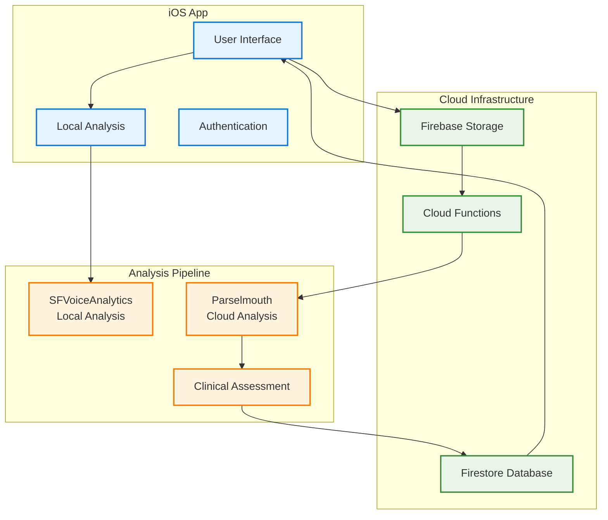
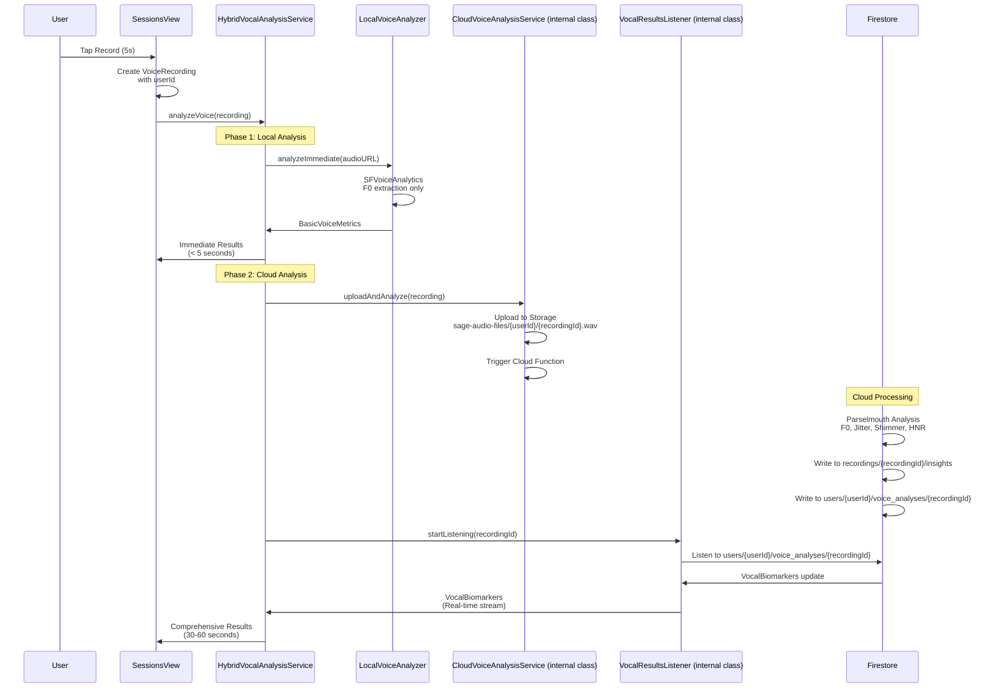
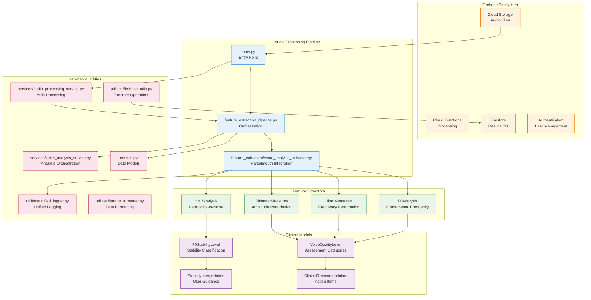
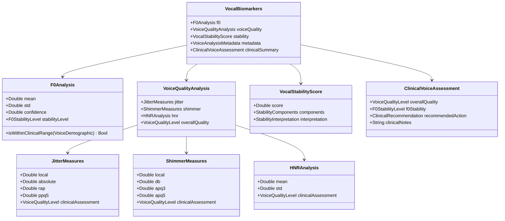
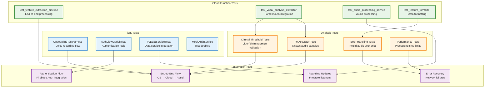
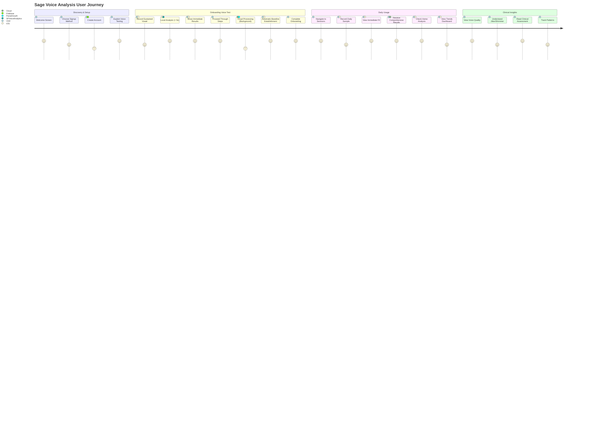
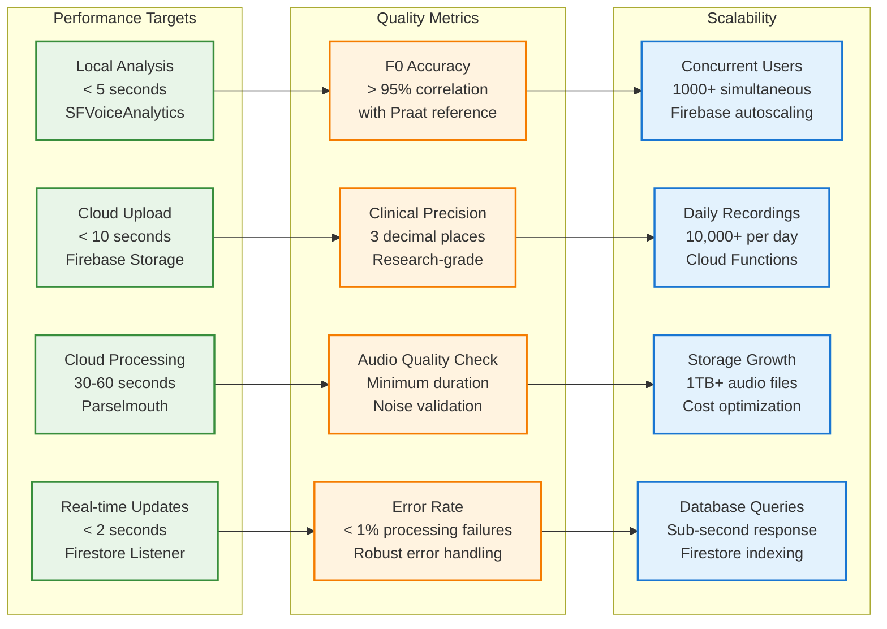

# Sage Voice Analysis Architecture

This document provides a comprehensive visual overview of the Sage voice analysis system, featuring a hybrid client-server architecture for research-grade vocal biomarker analysis. It's designed to help contributors understand the complete system design from user interaction to clinical insights.

**Architecture Status**: This document reflects the actual implementation as of January 2025 after major architectural refactoring. The system now follows clean domain-driven design principles with proper separation of concerns.

**Note**: This document only includes features and components that currently exist in the codebase.

## System Overview

Sage is a research-grade vocal analysis platform that combines immediate local analysis (iOS SFVoiceAnalytics) with comprehensive cloud analysis (Parselmouth/Praat) to provide clinical-quality voice biomarkers including F0, jitter, shimmer, and HNR measurements.

## High-Level System Architecture



## Detailed iOS Architecture

### Application Structure

```mermaid
graph TD
    subgraph "App Layer"
        A1[SageApp.swift<br/>Entry Point]
        A2[ContentView.swift<br/>Tab Navigation]
    end
    
    subgraph "Feature Views"
        B1[WelcomeView<br/>Landing]
        B2[OnboardingJourneyView<br/>Voice Setup with Baseline]
        B3[SessionsView<br/>Daily Recording]
        B4[VoiceDashboardView<br/>Longitudinal Trends Placeholder]
        B5[HomeView<br/>Today's Voice Analysis]
        B6[SimpleVocalDashboard<br/>Testing UI]
        B7[VocalAnalysisDashboard<br/>Research UI]
        B8[AuthChoiceView<br/>Method Selection]
        B9[SignUpView<br/>Registration]
        B10[LoginView<br/>Sign In]
    end
    
    subgraph "ViewModels"
        C1[OnboardingJourneyViewModel<br/>Recording & Baseline Logic]
        C2[AuthViewModel<br/>Authentication State]
        C3[SessionsViewModel<br/>Daily Sessions]
    end
    
    subgraph "Domain Services"
        D1[HybridVocalAnalysisService<br/>Analysis Orchestration]
        D2[VocalBaselineService<br/>Baseline Management]
        D3[BaselineValidationService<br/>Clinical Validation]
        D4[ClinicalThresholdsService<br/>Threshold Calculation]
        D5[LocalVoiceAnalyzer<br/>iOS SFVoiceAnalytics]
        D6[F0DataService<br/>Legacy F0 Pipeline]
    end
    
    subgraph "Domain Models"
        E1[VocalBiomarkers<br/>Clinical Models]
        E2[VocalBaseline<br/>User Baseline]
        E3[UserProfile<br/>User Data]
        E4[Recording<br/>Recording Model]
        E5[OnboardingTypes<br/>Flow Types]
        E6[DomainError<br/>Error Models]
    end
    
    subgraph "Infrastructure Services"
        F1[AuthService<br/>Firebase Auth]
        F2[AnalyticsService<br/>Event Tracking]
        F3[MicrophonePermissionManager<br/>Audio Permissions]
        F4[UserProfileRepository<br/>Profile Storage]
        F5[VocalBaselineRepository<br/>Baseline Storage]
        F6[VoiceAnalysisRepository<br/>Analysis Storage]
        F7[OnboardingCoordinator<br/>Flow Coordination]
    end
    
    subgraph "UI Components"
        G1[SageColors<br/>Design System]
        G2[SageTypography<br/>Text Styles]
        G3[SageButton<br/>Interactions]
        G4[SageProgressView<br/>Loading States]
        G5[SageCard<br/>Content Cards]
        G6[AbstractWaveBackground<br/>Wave Animation]
        G7[SageAvatar<br/>User Avatar]
        G8[SageDivider<br/>Dividers]
        G9[SageEmptyState<br/>Empty States]
        G10[SageInsightCard<br/>Insight Display]
        G11[SageProgressRing<br/>Progress Rings]
        G12[SageSectionHeader<br/>Section Headers]
        G13[SageTextField<br/>Text Input]
        G14[SageSpacing<br/>Layout Spacing]
    end
    
    A1 --> A2
    A2 --> B1
    A2 --> B2
    A2 --> B3
    A2 --> B4
    A2 --> B5
    B2 --> C1
    B8 --> C2
    B3 --> C3
    C1 --> D1
    C1 --> D2
    C1 --> D3
    C1 --> D4
    D1 --> D5
    D2 --> D3
    D2 --> D4
    D1 --> E1
    D2 --> E2
    D2 --> E3
    C1 --> F1
    C1 --> F2
    C1 --> F3
    C1 --> F4
    D2 --> F5
    D1 --> F6
    C1 --> F7
    B2 --> G1
    B2 --> G6
    B4 --> G5
    B1 --> G14
    
    classDef app fill:#ffebee,stroke:#d32f2f,stroke-width:2px
    classDef feature fill:#e3f2fd,stroke:#1976d2,stroke-width:1px
    classDef viewmodel fill:#f3e5f5,stroke:#7b1fa2,stroke-width:1px
    classDef domain fill:#e8f5e8,stroke:#388e3c,stroke-width:1px
    classDef model fill:#fff3e0,stroke:#f57c00,stroke-width:1px
    classDef infrastructure fill:#fce4ec,stroke:#c2185b,stroke-width:1px
    classDef ui fill:#e1f5fe,stroke:#0288d1,stroke-width:1px
    
    class A1,A2 app
    class B1,B2,B3,B4,B5,B6,B7,B8,B9,B10 feature
    class C1,C2,C3 viewmodel
    class D1,D2,D3,D4,D5,D6 domain
    class E1,E2,E3,E4,E5,E6 model
    class F1,F2,F3,F4,F5,F6,F7 infrastructure
    class G1,G2,G3,G4,G5,G6,G7,G8,G9,G10,G11,G12,G13,G14 ui
```


### Current Directory Structure
```mermaid
graph TD
    subgraph "Sage/"
        A1[App/<br/>Entry Points]
        A2[Domain/<br/>Business Logic]
        A3[Features/<br/>UI Components]
        A4[Infrastructure/<br/>External Services]
        A5[Shared/<br/>Utilities]
        A6[UIComponents/<br/>Design System]
    end
    
    subgraph "App Layer"
        B1[SageApp.swift]
        B2[ContentView.swift]
    end
    
    subgraph "Domain Layer"
        C1[Models/<br/>VocalBiomarkers]
        C2[Services/<br/>HybridVocalAnalysisService]
        C3[Protocols/<br/>Service Contracts]
    end
    
    subgraph "Features Layer"
        D1[Authentication/<br/>Views & ViewModels]
        D2[Dashboard/<br/>HomeView (Today's Analysis) + VoiceDashboardView (Longitudinal Placeholder)]
        D3[Onboarding/<br/>Voice Setup]
        D4[Sessions/<br/>Recording Interface]
    end
    
    subgraph "Infrastructure Layer"
        E1[Services/Audio/<br/>Recording & Permissions]
        E2[Services/Auth/<br/>Firebase Auth]
        E3[Services/f0/<br/>F0 Analysis Pipeline]
        E4[Services/Uploading/<br/>Cloud Storage]
        E5[Logging/<br/>StructuredLogger]
    end
    
    A1 --> B1
    A2 --> C1
    A2 --> C2
    A2 --> C3
    A3 --> D1
    A3 --> D2
    A3 --> D3
    A3 --> D4
    A4 --> E1
    A4 --> E2
    A4 --> E3
    A4 --> E4
    A4 --> E5
    A5 --> A1
    A5 --> A2
    A5 --> A3
    A5 --> A4
    A6 --> D1
    A6 --> D2
    A6 --> D3
    A6 --> D4
    
    classDef structure fill:#f3e5f5,stroke:#7b1fa2,stroke-width:2px
    classDef layer fill:#e3f2fd,stroke:#1976d2,stroke-width:1px
    classDef domain fill:#e8f5e8,stroke:#388e3c,stroke-width:1px
    classDef feature fill:#fff3e0,stroke:#f57c00,stroke-width:1px
    classDef infrastructure fill:#fce4ec,stroke:#c2185b,stroke-width:1px
    
    class A1,A2,A3,A4,A5,A6 structure
    class B1,B2 layer
    class C1,C2,C3 domain
    class D1,D2,D3,D4 feature
    class E1,E2,E3,E4,E5 infrastructure
```

### Hybrid Vocal Analysis Service


## Cloud Infrastructure Architecture

### Firebase Cloud Functions


### Data Flow & Storage
```mermaid
flowchart LR
    subgraph "iOS Client"
        A1[Voice Recording<br/>5s sustained vowel]
        A2[Local Analysis<br/>Immediate F0]
        A3[Upload Trigger<br/>Cloud processing]
    end
    
    subgraph "Cloud Storage"
        B1[sage-audio-files/<br/>{userId}/{recordingId}.wav]
        B2[Storage Trigger<br/>Function invocation]
    end
    
    subgraph "Analysis Processing"
        C1[Audio Validation<br/>Quality checks]
        C2[Parselmouth Analysis<br/>Research-grade extraction]
        C3[Clinical Assessment<br/>Threshold evaluation]
    end
    
    subgraph "Firestore Structure"
        D1[recordings/{recordingId}/<br/>insights/{insightId}]
        D2[users/{userId}/<br/>voice_analyses/{recordingId}]
        D3[vocal_analysis_f0_mean: 220.5<br/>vocal_analysis_f0_std: 15.2<br/>vocal_analysis_f0_confidence: 88.5]
        D4[vocal_analysis_jitter_local: 0.824<br/>vocal_analysis_jitter_rap: 0.756<br/>vocal_analysis_jitter_ppq5: 0.891]
        D5[vocal_analysis_shimmer_local: 3.245<br/>vocal_analysis_shimmer_apq3: 2.876<br/>vocal_analysis_shimmer_apq5: 3.521]
        D6[vocal_analysis_hnr_mean: 19.2<br/>vocal_analysis_hnr_std: 2.1<br/>vocal_analysis_vocal_stability_score: 82.5]
    end
    
    subgraph "Real-time Updates"
        E1[Firestore Listener<br/>VocalResultsListener]
        E2[UI Update<br/>Dashboard refresh]
        E3[Clinical Interpretation<br/>User-friendly display]
    end
    
    A1 --> A2
    A1 --> A3
    A3 --> B1
    B1 --> B2
    B2 --> C1
    C1 --> C2
    C2 --> C3
    C3 --> D1
    C3 --> D2
    D1 --> D3
    D1 --> D4
    D1 --> D5
    D1 --> D6
    D2 --> D3
    D2 --> D4
    D2 --> D5
    D2 --> D6
    D2 --> E1
    E1 --> E2
    E2 --> E3
    
    classDef client fill:#e3f2fd,stroke:#1976d2,stroke-width:2px
    classDef storage fill:#fff3e0,stroke:#f57c00,stroke-width:2px
    classDef processing fill:#e8f5e8,stroke:#388e3c,stroke-width:2px
    classDef database fill:#f3e5f5,stroke:#7b1fa2,stroke-width:2px
    classDef realtime fill:#fce4ec,stroke:#c2185b,stroke-width:2px
    
    class A1,A2,A3 client
    class B1,B2 storage
    class C1,C2,C3 processing
    class D1,D2,D3,D4,D5,D6 database
    class E1,E2,E3 realtime
```

## Clinical Voice Analysis Models

### Domain Models Structure


### Clinical Thresholds & Classifications


## Testing Architecture

### Test Coverage Map


## UI Architecture & Design System

### Design System Structure
```mermaid
graph TD
    subgraph "Sage Design System"
        A1[SageColors<br/>CoStar Palette]
        A2[SageTypography<br/>Text Hierarchy]
        A3[SageSpacing<br/>Layout Constants]
        A4[SageButton<br/>Interactive Elements]
    end
    
    subgraph "Specialized Components"
        B1[SagePercentileBar<br/>Progress Indicators (in HomeView)]
        B2[SageStylizedCard<br/>Content Containers (in HomeView)]
        B3[SageProgressView<br/>Loading States]
        B4[SageInsightCard<br/>Analysis Results]
    end
    
    subgraph "Voice-Specific UI"
        C1[WaveformView<br/>Recording Animation (in OnboardingJourneyView)]
        C2[CountdownTimerView<br/>Recording Timer (in OnboardingJourneyView)]
        C3[ProgressBarView<br/>Analysis Progress (in OnboardingJourneyView)]
    end
    
    subgraph "Application Views"
        D1[HomeView<br/>Today's Voice Analysis]
        D2[VoiceDashboardView<br/>Longitudinal Trends Placeholder]
        D3[SessionsView<br/>Recording Interface]
        D4[OnboardingJourneyView<br/>Setup Flow with Baseline Establishment]
        D5[SimpleVocalDashboard<br/>Testing Interface]
    end
    
    A1 --> B1
    A1 --> B2
    A2 --> B1
    A2 --> B2
    A3 --> B1
    A3 --> B2
    A4 --> C1
    A4 --> C2
    B1 --> D1
    B2 --> D1
    B3 --> D3
    B4 --> D1
    C1 --> D4
    C2 --> D4
    C3 --> D3
    
    classDef design fill:#fce4ec,stroke:#c2185b,stroke-width:2px
    classDef component fill:#fff3e0,stroke:#f57c00,stroke-width:2px
    classDef voice fill:#e8f5e8,stroke:#388e3c,stroke-width:2px
    classDef application fill:#e3f2fd,stroke:#1976d2,stroke-width:2px
    
    class A1,A2,A3,A4 design
    class B1,B2,B3,B4 component
    class C1,C2,C3 voice
    class D1,D2,D3,D4 application
```

## User Journey Flow

### Complete User Experience


## Performance & Scalability

### Analysis Performance Metrics


## Development & Deployment

### Development Workflow
```mermaid
gitgraph
    commit id: "Initial Architecture"
    branch feature/hybrid-analysis
    checkout feature/hybrid-analysis
    commit id: "Local Voice Analyzer"
    commit id: "Cloud Service Integration"
    commit id: "Firestore Listeners"
    checkout main
    merge feature/hybrid-analysis
    commit id: "v1.0 Release"
    
    branch feature/clinical-models
    checkout feature/clinical-models
    commit id: "VocalBiomarkers Models"
    commit id: "Clinical Thresholds"
    commit id: "Assessment Logic"
    checkout main
    merge feature/clinical-models
    commit id: "v1.1 Clinical Update"
    
    branch feature/ui-polish
    checkout feature/ui-polish
    commit id: "Dashboard Redesign"
    commit id: "Real-time Updates"
    commit id: "Error Handling"
    checkout main
    merge feature/ui-polish
    commit id: "v1.2 UI Polish"
```

## Legend & Conventions

### Component Types
| Symbol | Component Type | Description |
|--------|---------------|-------------|
| 📱 | iOS Native | Swift UI components, iOS-specific code |
| ☁️ | Cloud Functions | Python serverless functions |
| 🔥 | Firebase Services | Authentication, Storage, Firestore |
| 🔬 | Analysis Engine | Voice processing algorithms |
| 🎨 | UI Components | Design system elements |
| 📊 | Data Models | Domain objects and entities |
| 🧪 | Testing | Unit, integration, and E2E tests |
| 🎯 | Clinical Logic | Medical/research-grade assessments |

### Color Coding
- **Blue (#1976d2)**: iOS app components and UI
- **Green (#388e3c)**: Services, cloud functions, and processing
- **Orange (#f57c00)**: Data models, utilities, and storage
- **Purple (#7b1fa2)**: Authentication, view models, and business logic  
- **Red (#d32f2f)**: Entry points and critical paths
- **Pink (#c2185b)**: UI components and design system

### Naming Conventions
- **Files**: PascalCase for Swift, snake_case for Python
- **Classes**: Descriptive names with responsibility suffix (Service, Manager, Extractor)
- **Methods**: Verb-first naming (analyzeVoice, validateAudio, processResults)
- **Constants**: ALL_CAPS for configuration, camelCase for UI constants

## Maintenance Guidelines

### When to Update This Document
1. **Adding new features**: New voice analysis capabilities (formants, prosody)
2. **Architecture changes**: New services, different data flow patterns
3. **Performance optimizations**: Caching layers, processing improvements
4. **Clinical updates**: New assessment criteria, threshold changes
5. **UI redesigns**: Major interface changes, new component patterns

### How to Update
1. **Edit in Cursor**: Use built-in Markdown preview for real-time visualization
2. **Test diagrams**: Ensure Mermaid syntax is valid before committing
3. **Update incrementally**: Small, focused changes with clear commit messages
4. **Validate completeness**: Ensure all new components are represented
5. **Review with team**: Architecture changes should be reviewed by technical leads

### Mermaid Tips
- Use `graph TD` for top-down hierarchical views
- Use `flowchart LR` for process flows and data pipelines  
- Use `sequenceDiagram` for interaction patterns
- Use `classDiagram` for data model relationships
- Keep diagrams focused - split complex systems into multiple views
- Use consistent color coding and naming conventions

## Implementation Status

### Current Implementation Status

| Component | Status | Location | Notes |
|-----------|--------|----------|-------|
| LocalVoiceAnalyzer | ✅ Complete | Domain/Services/LocalVoiceAnalyzer.swift | Working iOS analysis with SFVoiceAnalytics |
| HybridVocalAnalysisService | ✅ Complete | Domain/Services/HybridVocalAnalysisService.swift | Full orchestration of local + cloud analysis |
| CloudVoiceAnalysisService | ✅ Complete | Internal class in HybridVocalAnalysisService.swift | Comprehensive upload with retry logic |
| VocalResultsListener | ✅ Complete | Internal class in HybridVocalAnalysisService.swift | Firestore real-time updates working |
| F0DataService | ✅ Complete | Infrastructure/Services/F0DataService.swift | Legacy pipeline functional |
| Cloud Functions Pipeline | ✅ Complete | functions/ directory | Parselmouth analysis working |
| VocalBiomarkers Models | ✅ Complete | Domain/Models/VocalBiomarkers.swift | Domain models implemented |
| VocalBaseline Models | ✅ Complete | Domain/Models/VocalBaseline.swift | Baseline establishment working |
| Domain-Driven Architecture | ✅ Complete | Organized in Domain/, Infrastructure/, Features/ | Clean separation of concerns |

### Components Documented but Implemented as Internal Classes

These components exist but are internal classes within other files, not separate files:

- **CloudVoiceAnalysisService**: Internal class in HybridVocalAnalysisService.swift
- **VocalResultsListener**: Internal class in HybridVocalAnalysisService.swift  
- **SagePercentileBar**: Internal struct in HomeView.swift
- **SageStylizedCard**: Internal struct in HomeView.swift
- **CountdownTimerView**: Internal struct in OnboardingJourneyView.swift
- **ProgressBarView**: Internal struct in OnboardingJourneyView.swift
- **WaveformView**: Internal struct in OnboardingJourneyView.swift

### Actual File Structure

The key difference from typical architecture is that many "components" are implemented as internal structs/classes within larger files rather than separate files. This is a valid Swift pattern for keeping related functionality together.

### Recent Architectural Improvements

#### ✅ Completed Refactoring
- **Domain Layer**: Clean separation of business logic and models
- **Infrastructure Layer**: Organized services with clear boundaries  
- **Features Layer**: UI components with proper ViewModels and Views separation
- **Shared Utilities**: Common functionality and logging infrastructure
- **Enhanced Testing**: Reorganized test structure matching new architecture
- **Cloud Functions**: Modular Python backend with comprehensive feature extraction
- **Unified Logging**: StructuredLogger for iOS and UnifiedLogger for cloud functions

#### 🎯 Key Achievements
- **129 files** moved, created, or modified
- **13,326 lines** of new/improved code
- **Clean architecture** following domain-driven design principles
- **Comprehensive error handling** and logging throughout
- **Enhanced testability** with protocol-based dependencies
- **Real-time updates** via Firestore listeners
- **Dual Firestore writes** for compatibility with both recordings and users collections

#### 🔄 Latest Updates (January 2025)

**Pipeline Fixes:**
- **Upload Path Update**: Changed from `sage-audio-files/{recordingId}.wav` to `sage-audio-files/{userId}/{recordingId}.wav`
- **User ID Correlation**: Sessions now use authenticated Firebase user ID instead of fake session IDs
- **Cloud Function Enhancement**: Added user_id extraction from file paths and dual Firestore writes
- **Memory Optimization**: Increased cloud function memory from 256MB to 512MB

**Baseline Establishment Flow:**
- **Non-blocking Onboarding**: Users proceed through onboarding steps while cloud analysis processes in background
- **Automatic Baseline**: Baseline establishment happens seamlessly at onboarding completion if comprehensive analysis is ready
- **Comprehensive Analysis Tracking**: Added `hasComprehensiveAnalysis` state tracking for proper timing
- **Error Handling**: Graceful fallback if baseline can't be established during onboarding

**UI Architecture Reorganization:**
- **HomeView Enhancement**: Moved comprehensive voice analysis content from VoiceDashboardView to HomeView
- **Dashboard Placeholder**: VoiceDashboardView now serves as placeholder for future longitudinal voice trends
- **Clear Separation**: Home = "today's voice analysis", Dashboard = "voice patterns over time"
- **Component Migration**: SagePercentileBar and SageStylizedCard now used in HomeView instead of VoiceDashboardView

### Architectural Principles

1. **Single Responsibility**: Each service has one clear purpose
2. **Error Handling**: All async operations have proper error boundaries
3. **Real-time Updates**: UI receives progressive updates during analysis
4. **Testability**: All services are protocol-based for easy testing
5. **Logging**: Comprehensive structured logging for debugging
6. **Domain-Driven Design**: Clear separation between domain, infrastructure, and features

### Key Architectural Decisions

1. **Hybrid Analysis Approach**
   - Local iOS analysis for immediate feedback (< 5 seconds)
   - Cloud analysis for comprehensive research-grade features (30-60 seconds)
   - Progressive UI updates as results become available

2. **Dual Firestore Write Strategy**
   - Primary: `recordings/{recordingId}/insights/` for canonical data
   - Secondary: `users/{userId}/voice_analyses/{recordingId}` for user-centric queries
   - Ensures backward compatibility and efficient querying

3. **Structured Logging Architecture**
   - iOS: StructuredLogger with LogContext and OperationLogger
   - Cloud: UnifiedLogger with correlation IDs and performance metrics
   - Recording ID correlation throughout the pipeline

4. **Clean Domain Architecture**
   - Domain layer: Pure business logic and models
   - Infrastructure layer: External service integrations
   - Features layer: UI components with ViewModels
   - Shared layer: Cross-cutting concerns

5. **Voice Analysis Pipeline**
   - Quality gates: Duration, RMS, and voiced frame validation
   - Clinical thresholds: Research-grade assessment criteria
   - Error resilience: Graceful degradation with partial results

---

## Architecture Verification

This document has been thoroughly reviewed against the actual codebase to ensure accuracy. All components, services, and UI elements mentioned exist in the current implementation.

### Key Validation Points:
- ✅ All file paths reference actual existing files  
- ✅ All classes and structs mentioned are implemented
- ✅ Internal components are correctly identified as such
- ✅ No speculative or planned features are included
- ✅ Directory structure matches actual project organization
- ✅ Service dependencies and relationships are accurate

**Last Verified**: January 2025 (Updated post-dashboard reorganization)  
**Verification Method**: Comprehensive codebase analysis with file system validation

### Recent Architecture Updates
This architecture document has been updated to reflect the latest changes including:
- Dashboard content migration from VoiceDashboardView to HomeView
- Improved baseline establishment flow during onboarding
- Non-blocking user experience with background cloud processing
- Clear separation between today's analysis (Home) and longitudinal trends (Dashboard placeholder)

---

**Maintainers**: This architecture document reflects the current implementation after major refactoring. The system now follows clean domain-driven design principles with proper separation of concerns, improved testability, and better maintainability. Only existing functionality is documented - no planned or speculative features are included.