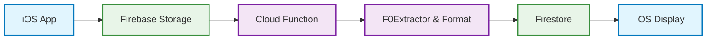
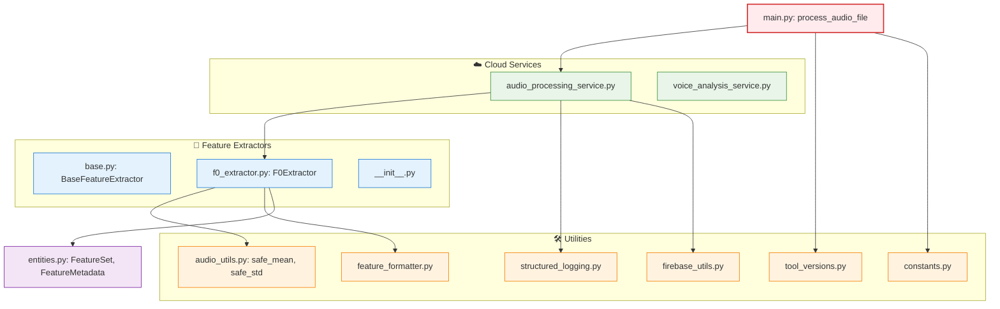

# Sage Voice Analysis Architecture

This document provides a visual overview of the Sage voice analysis pipeline, from user audio input to extracted speech features and real-time app display. It is designed to help new contributors understand how audio data flows through the system and how the modular architecture supports feature expansion.

## System Flow Diagram

### High-Level System Flow

### iOS App Architecture

```mermaid
graph TD
    %% Views Layer
    subgraph Views ["📱 Views Layer"]
        A1[SageApp.swift]
        A2[ContentView.swift]
        A3[OnboardingJourneyView.swift]
        A4[AuthChoiceView.swift]
        A5[LoginView.swift]
        A6[SignUpView.swift]
        A7[VoiceDashboardView.swift]
        A8[HomeView.swift]
        A9[SessionsView.swift]
    end

    %% ViewModels Layer
    subgraph ViewModels ["🧠 ViewModels Layer"]
        B1[OnboardingJourneyViewModel.swift]
        B2[AuthViewModel.swift]
        B3[SessionsViewModel.swift]
    end

    %% Services Layer
    subgraph Services ["🔧 Services Layer"]
        C1[AuthService.swift]
        C2[AudioRecorderProtocol.swift]
        C3[MicrophonePermissionManager.swift]
        C4[OnboardingAudioRecorder.swift]
        C5[F0DataService.swift]
        C6[AudioUploader.swift]
        C7[RecordingUploaderService.swift]
        C8[UserProfileRepository.swift]
        C9[AnalyticsService.swift]
    end

    %% Models Layer
    subgraph Models ["📊 Models Layer"]
        D1[UserProfile.swift]
        D2[UserProfileValidator.swift]
        D3[Recording.swift]
        D4[RecordingValidator.swift]
        D5[AudioRecorder.swift]
        D6[OnboardingProtocols.swift]
        D7[OnboardingTypes.swift]
    end

    %% UI Components
    subgraph UIComponents ["🎨 UI Components"]
        E1[SageButton.swift]
        E2[SageCard.swift]
        E3[SageTextField.swift]
        E4[SageColors.swift]
        E5[SageTypography.swift]
        E6[SageProgressView.swift]
        E7[SageAvatar.swift]
        E8[SageInsightCard.swift]
        E9[SageEmptyState.swift]
    end

    %% Data Flow
    A3 --> B1
    B1 --> C7
    B1 --> D1
    B1 --> D3
    A3 --> E1
    A3 --> E2
    A3 --> E3

    classDef view fill:#e3f2fd,stroke:#1976d2,stroke-width:1px
    classDef viewmodel fill:#f3e5f5,stroke:#7b1fa2,stroke-width:1px
    classDef service fill:#e8f5e8,stroke:#388e3c,stroke-width:1px
    classDef model fill:#fff3e0,stroke:#f57c00,stroke-width:1px
    classDef ui fill:#fce4ec,stroke:#c2185b,stroke-width:1px

    class A1,A2,A3,A4,A5,A6,A7,A8,A9 view
    class B1,B2,B3 viewmodel
    class C1,C2,C3,C4,C5,C6,C7,C8,C9 service
    class D1,D2,D3,D4,D5,D6,D7 model
    class E1,E2,E3,E4,E5,E6,E7,E8,E9 ui
```

### Cloud Functions Architecture

### Testing Architecture

```mermaid
graph TD
    %% Cloud Tests
    subgraph CloudTests ["☁️ Cloud Function Tests"]
        A1[test_audio_processing_service.py]
        A2[test_feature_formatter.py]
        A3[test_integration.py]
        A4[test_main_integration.py]
    end

    %% iOS Tests
    subgraph iOSTests ["📱 iOS Tests"]
        B1[AppFlowTests.swift]
        B2[AuthFlowTests.swift]
        B3[AuthViewModelTests.swift]
        B4[OnboardingTestHarness.swift]
        B5[SignupFlowTests.swift]
        B6[VocalTestScreenTests.swift]
        B7[ReadingPromptTests.swift]
        B8[ExplainerScreenTests.swift]
        B9[FinalStepTests.swift]
        B10[AudioUploadTests.swift]
        B11[HomeViewTests.swift]
        B12[RecordingValidationTests.swift]
        B13[F0DataServiceTests.swift]
    end

    %% Test Coverage
    A1 --> G1[audio_processing_service.py]
    A2 --> G2[feature_formatter.py]
    A3 --> G3[f0_extractor.py]
    A4 --> G4[main.py]
    B1 --> H1[SageApp.swift]
    B2 --> H2[LoginView.swift]
    B3 --> H3[AuthViewModel.swift]
    B4 --> H4[OnboardingJourneyView.swift]
    B5 --> H5[SignUpView.swift]
    B6 --> H4
    B7 --> H4
    B8 --> H4
    B9 --> H4
    B10 --> H6[RecordingUploaderService.swift]
    B11 --> H7[HomeView.swift]
    B12 --> H8[RecordingValidator.swift]
    B13 --> H9[F0DataService.swift]

    classDef cloudTest fill:#e8f5e8,stroke:#388e3c,stroke-width:1px
    classDef iOSTest fill:#e3f2fd,stroke:#1976d2,stroke-width:1px
    classDef target fill:#fff3e0,stroke:#f57c00,stroke-width:1px

    class A1,A2,A3,A4 cloudTest
    class B1,B2,B3,B4,B5,B6,B7,B8,B9,B10,B11,B12,B13 iOSTest
    class G1,G2,G3,G4,H1,H2,H3,H4,H5,H6,H7,H8,H9 target
```

## Legend

| Symbol | Meaning |
|--------|---------|
| 📱 | iOS App Components |
| ☁️ | Cloud Function Components |
| 🧠 | ViewModels (Business Logic) |
| 🔧 | Services (Data & Network) |
| 📊 | Models (Data Structures) |
| 🎨 | UI Components |
| 🔬 | Feature Extractors |
| 🛠️ | Utilities |
| 🧪 | Tests |

## Color Coding

- **Blue**: Views and iOS Tests
- **Purple**: ViewModels and Entities
- **Green**: Services and Cloud Tests
- **Orange**: Models and Utilities
- **Red**: Entry Points
- **Pink**: UI Components

## Maintaining This Diagram

To keep this diagram useful, it must evolve with your architecture.

### When to Update

Update the diagram when:

- Adding a new feature extractor (e.g., jitter, shimmer)
- Changing how audio is processed, stored, or displayed
- Modifying the Cloud Function's processing logic
- Introducing new services or stages in the pipeline

### How to Update in Cursor

1. Open `ARCHITECTURE.md` in Cursor
2. Edit the Mermaid diagram block using plain Markdown
3. Use the built-in Markdown Preview in Cursor to visualize changes
4. Follow these naming rules:
   - Use `[ComponentName: Description]` format for clarity
   - Maintain left-to-right or top-down direction (`graph TD`)
5. Commit changes with a message like: `docs: update architecture diagram for shimmer extractor`

If you're unsure how to update the diagram, ask in the project Slack or check with the voice pipeline maintainer.

**Maintainers**: Please ensure Mermaid support in your Markdown renderer (e.g., GitHub, Cursor) is active. No external setup is required in Cursor; just use Preview Mode to see it live. 