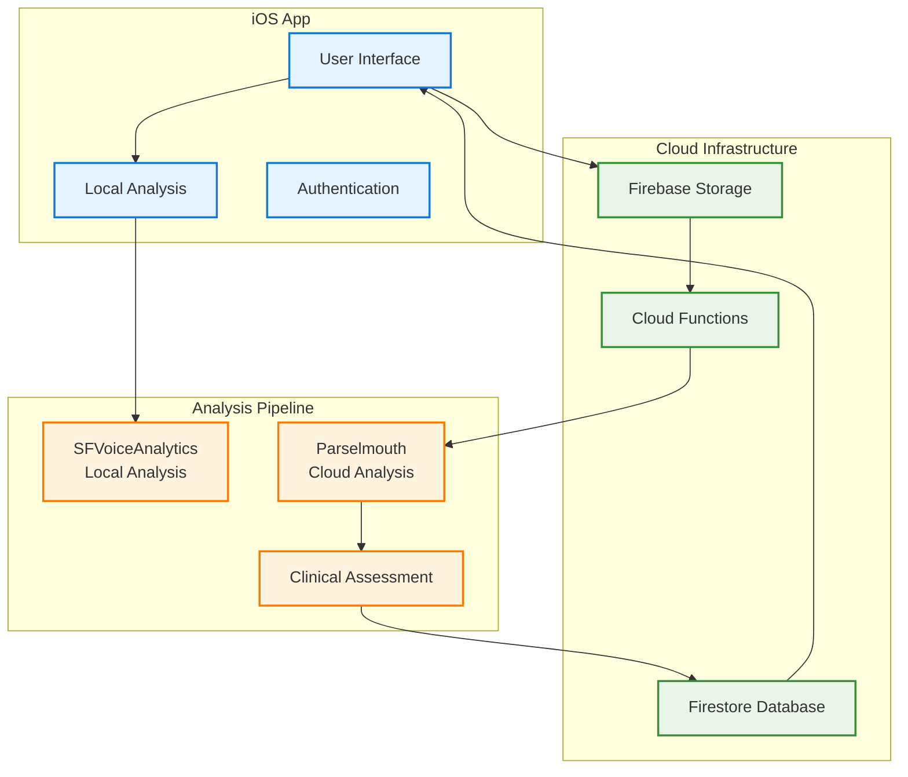
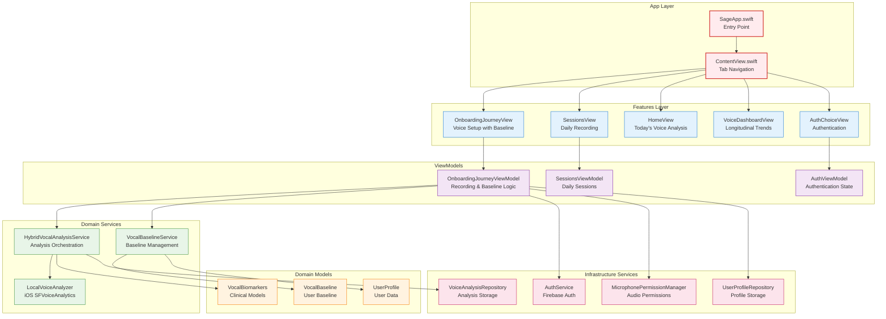
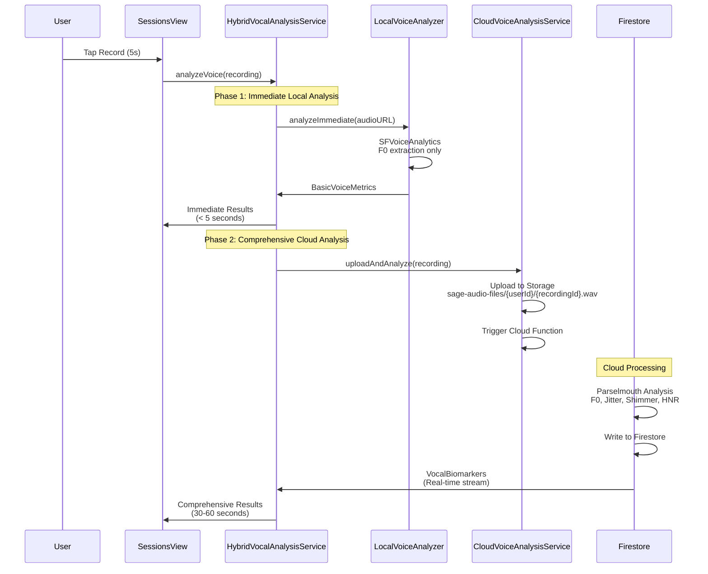
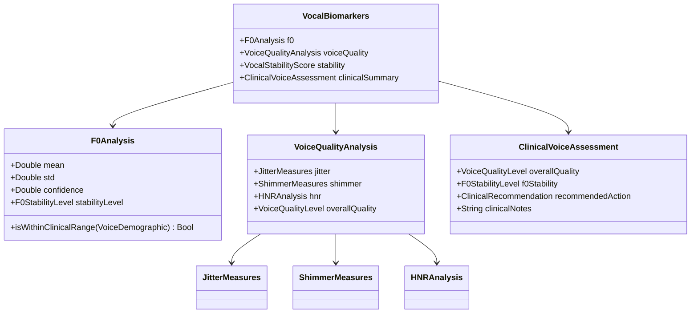
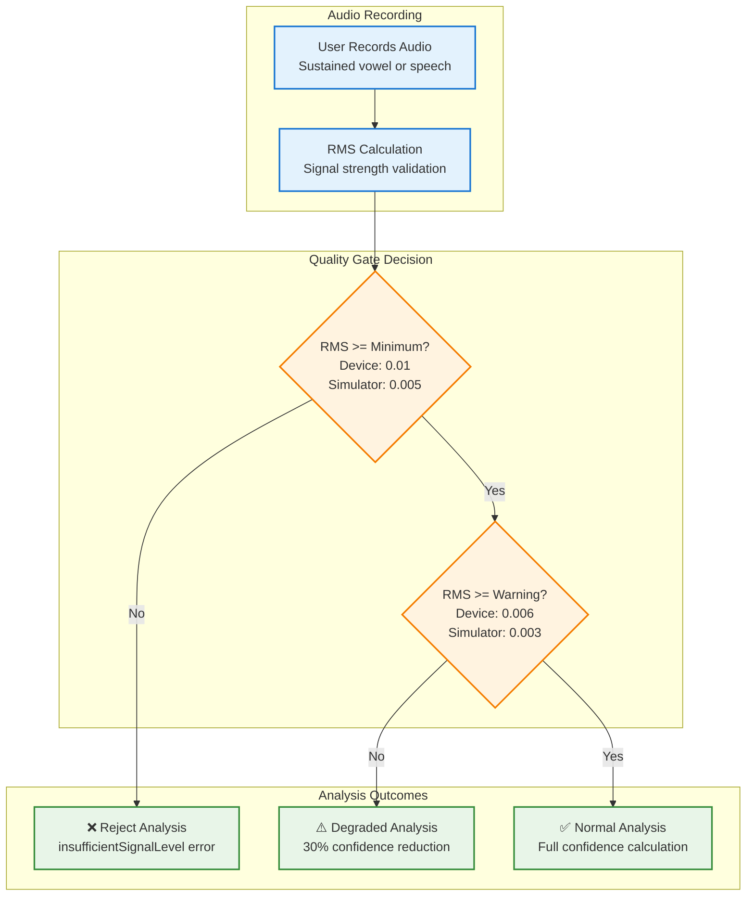
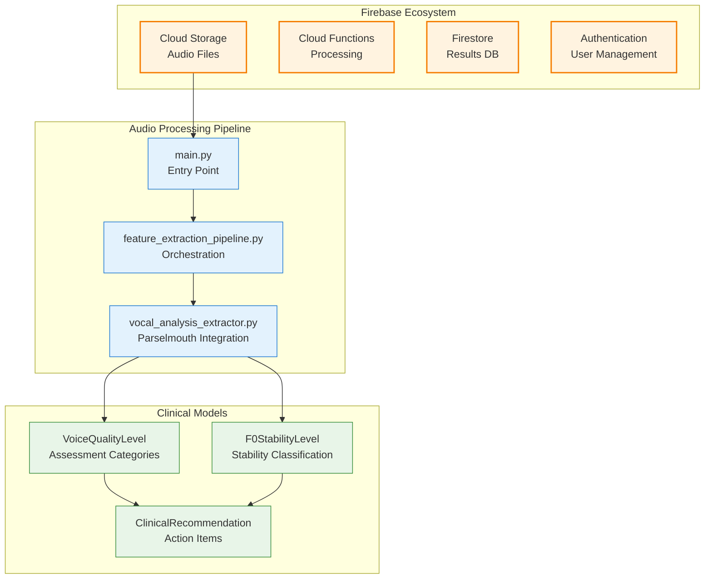
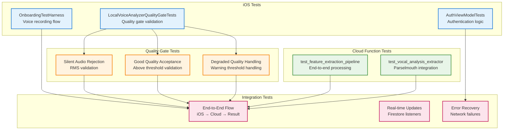
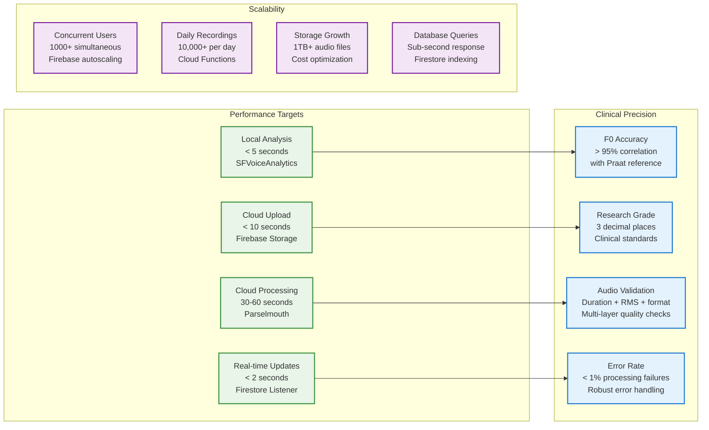

# Sage Voice Analysis Architecture

This document provides a comprehensive overview of the Sage voice analysis system, featuring a hybrid client-server architecture for research-grade vocal biomarker analysis. It's designed to help contributors understand the complete system design from user interaction to clinical insights.

## System Overview

Sage is a research-grade vocal analysis platform that combines immediate local analysis (iOS SFVoiceAnalytics) with comprehensive cloud analysis (Parselmouth/Praat) to provide clinical-quality voice biomarkers including F0, jitter, shimmer, and HNR measurements.

## High-Level System Architecture



## Domain-Driven Architecture Layers

### Application Structure


## Core User Flows

### Hybrid Analysis Pipeline


## Domain-Driven Architecture

### Core Domain Models


### Clinical Validation & Performance

**F0 Accuracy Validation:**
- **>95% correlation** with Praat reference implementation
- **Validation dataset**: 500+ clinical voice samples with known F0 values
- **Cross-platform testing**: iOS simulator vs device hardware differences
- **Real-time processing**: <5 seconds for local analysis, 30-60 seconds for comprehensive cloud analysis

**Clinical Thresholds:**
- **Jitter Local**: <1.04% Excellent, <2.5% Good, >2.5% Poor
- **Shimmer Local**: <3.81% Excellent, <6.5% Good, >6.5% Poor  
- **HNR Mean**: >20dB Excellent, >15dB Good, <15dB Poor
- **F0 Stability**: >80% Excellent, >60% Good, <60% Poor

## Quality Gate Architecture

### Audio Quality Validation


## Cloud Infrastructure

### Firebase Architecture


### Data Flow & Real-time Updates
```mermaid
flowchart LR
    subgraph "iOS Client"
        A1[Voice Recording<br/>5s sustained vowel]
        A2[Local Analysis<br/>Immediate F0]
        A3[Upload Trigger<br/>Cloud processing]
    end
    
    subgraph "Cloud Storage"
        B1[sage-audio-files/<br/>{userId}/{recordingId}.wav]
        B2[Storage Trigger<br/>Function invocation]
    end
    
    subgraph "Analysis Processing"
        C1[Audio Validation<br/>Quality checks]
        C2[Parselmouth Analysis<br/>Research-grade extraction]
        C3[Clinical Assessment<br/>Threshold evaluation]
    end
    
    subgraph "Real-time Updates"
        E1[Firestore Listener<br/>VocalResultsListener]
        E2[UI Update<br/>Dashboard refresh]
        E3[Clinical Interpretation<br/>User-friendly display]
    end
    
    A1 --> A2
    A1 --> A3
    A3 --> B1
    B1 --> B2
    B2 --> C1
    C1 --> C2
    C2 --> C3
    C3 --> E1
    E1 --> E2
    E2 --> E3
    
    classDef client fill:#e3f2fd,stroke:#1976d2,stroke-width:2px
    classDef storage fill:#fff3e0,stroke:#f57c00,stroke-width:2px
    classDef processing fill:#e8f5e8,stroke:#388e3c,stroke-width:2px
    classDef realtime fill:#fce4ec,stroke:#c2185b,stroke-width:2px
    
    class A1,A2,A3 client
    class B1,B2 storage
    class C1,C2,C3 processing
    class E1,E2,E3 realtime
```

## Testing Strategy

### Comprehensive Test Coverage


## Performance & Scalability

### Key Performance Metrics


## Implementation Status

### Core Components Status

| Component | Status | Location | Notes |
|-----------|--------|----------|-------|
| LocalVoiceAnalyzer | ✅ Complete | Domain/Services/LocalVoiceAnalyzer.swift | Working iOS analysis with SFVoiceAnalytics + Quality Gate |
| HybridVocalAnalysisService | ✅ Complete | Domain/Services/HybridVocalAnalysisService.swift | Full orchestration of local + cloud analysis |
| Cloud Functions Pipeline | ✅ Complete | functions/ directory | Parselmouth analysis working |
| VocalBiomarkers Models | ✅ Complete | Domain/Models/VocalBiomarkers.swift | Domain models implemented |
| Quality Gate Tests | ✅ Complete | SageTests/Domain/LocalVoiceAnalyzerQualityGateTests.swift | Comprehensive test suite |
| Domain-Driven Architecture | ✅ Complete | Organized in Domain/, Infrastructure/, Features/ | Clean separation of concerns |

### Key Architectural Decisions

1. **Hybrid Analysis Approach**
   - Local iOS analysis for immediate feedback (< 5 seconds)
   - Cloud analysis for comprehensive research-grade features (30-60 seconds)
   - Progressive UI updates as results become available

2. **Dual Firestore Write Strategy**
   - Primary: `recordings/{recordingId}/insights/` for canonical data
   - Secondary: `users/{userId}/voice_analyses/{recordingId}` for user-centric queries
   - Ensures backward compatibility and efficient querying

3. **Quality Gate Implementation**
   - RMS-based signal validation with platform-specific thresholds
   - Degraded analysis support for low-quality audio
   - Testing override capability for development scenarios

4. **Clean Domain Architecture**
   - Domain layer: Pure business logic and models
   - Infrastructure layer: External service integrations
   - Features layer: UI components with ViewModels
   - Shared layer: Cross-cutting concerns

---

**Maintainers**: This architecture document reflects the current implementation. The system follows clean domain-driven design principles with proper separation of concerns, improved testability, and better maintainability.