# Sage Voice Analysis Architecture

This document provides a comprehensive visual overview of the Sage voice analysis system, featuring a hybrid client-server architecture for research-grade vocal biomarker analysis. It's designed to help contributors understand the complete system design from user interaction to clinical insights.

**⚠️ Architecture Status**: This document reflects the actual implementation as of July 2025. See [Architectural Debt](#-architectural-debt-tracker) section for planned improvements.

## 🎯 System Overview

Sage is a research-grade vocal analysis platform that combines immediate local analysis (iOS SFVoiceAnalytics) with comprehensive cloud analysis (Parselmouth/Praat) to provide clinical-quality voice biomarkers including F0, jitter, shimmer, and HNR measurements.

## 📊 High-Level System Architecture


## 🏗️ Detailed iOS Architecture

### Application Structure

```mermaid
graph TD
    subgraph "🎯 App Layer"
        A1[SageApp.swift<br/>Entry Point]
        A2[ContentView.swift<br/>Tab Navigation]
    end
    
    subgraph "📱 Feature Views"
        B1[WelcomeView<br/>Landing]
        B2[OnboardingJourneyView<br/>Voice Setup]
        B3[SessionsView<br/>Daily Recording]
        B4[VoiceDashboardView<br/>Analysis Results]
        B5[HomeView<br/>Insights]
    end
    
    subgraph "🔐 Authentication"
        C1[AuthChoiceView<br/>Method Selection]
        C2[SignUpView<br/>Registration]
        C3[LoginView<br/>Sign In]
        C4[AuthViewModel<br/>State Management]
    end
    
    subgraph "🎙️ Voice Recording"
        D1[OnboardingJourneyViewModel<br/>Recording Logic]
        D2[HybridVocalAnalysisService<br/>Analysis Orchestration]
        D3[LocalVoiceAnalyzer<br/>iOS SFVoiceAnalytics]
        D4[CloudVoiceAnalysisService<br/>Upload & Trigger]
        D5[F0DataService<br/>Legacy F0 Pipeline]
    end
    
    subgraph "📊 Data Models"
        E1[VocalBiomarkers<br/>Clinical Models]
        E2[VoiceRecording<br/>Audio Data]
        E3[UserProfile<br/>User Data]
        E4[AnalysisResult<br/>Combined Results]
    end
    
    subgraph "🎨 UI Components"
        F1[SageColors<br/>Design System]
        F2[SageTypography<br/>Text Styles]
        F3[SageButton<br/>Interactions]
        F4[SageProgressView<br/>Loading States]
    end
    
    A1 --> A2
    A2 --> B1
    A2 --> B2
    A2 --> B3
    A2 --> B4
    A2 --> B5
    B1 --> C1
    C1 --> C2
    C1 --> C3
    C2 --> C4
    C3 --> C4
    B2 --> D1
    D1 --> D2
    D2 --> D3
    D2 --> D4
    D1 --> D5
    D2 --> E1
    D2 --> E2
    C4 --> E3
    D2 --> E4
    D5 --> E4
    B1 --> F1
    B1 --> F2
    B1 --> F3
    B2 --> F4
    
    classDef app fill:#ffebee,stroke:#d32f2f,stroke-width:2px
    classDef feature fill:#e3f2fd,stroke:#1976d2,stroke-width:1px
    classDef auth fill:#f3e5f5,stroke:#7b1fa2,stroke-width:1px
    classDef voice fill:#e8f5e8,stroke:#388e3c,stroke-width:1px
    classDef data fill:#fff3e0,stroke:#f57c00,stroke-width:1px
    classDef ui fill:#fce4ec,stroke:#c2185b,stroke-width:1px
    
    class A1,A2 app
    class B1,B2,B3,B4,B5 feature
    class C1,C2,C3,C4 auth
    class D1,D2,D3,D4 voice
    class E1,E2,E3,E4 data
    class F1,F2,F3,F4 ui
```


### Hybrid Vocal Analysis Service


## ☁️ Cloud Infrastructure Architecture

### Firebase Cloud Functions


### Data Flow & Storage
```mermaid
flowchart LR
    subgraph "📱 iOS Client"
        A1[Voice Recording<br/>10s sustained vowel]
        A2[Local Analysis<br/>Immediate F0]
        A3[Upload Trigger<br/>Cloud processing]
    end
    
    subgraph "☁️ Cloud Storage"
        B1[voice_recordings/<br/>user_id/recording.wav]
        B2[Storage Trigger<br/>Function invocation]
    end
    
    subgraph "🔬 Analysis Processing"
        C1[Audio Validation<br/>Quality checks]
        C2[Parselmouth Analysis<br/>Research-grade extraction]
        C3[Clinical Assessment<br/>Threshold evaluation]
    end
    
    subgraph "📊 Firestore Structure"
        D1[users/{userId}/<br/>voice_analyses/{recordingId}]
        D2[vocal_analysis_f0_mean: 220.5<br/>vocal_analysis_f0_std: 15.2<br/>vocal_analysis_f0_confidence: 88.5]
        D3[vocal_analysis_jitter_local: 0.824<br/>vocal_analysis_jitter_rap: 0.756<br/>vocal_analysis_jitter_ppq5: 0.891]
        D4[vocal_analysis_shimmer_local: 3.245<br/>vocal_analysis_shimmer_apq3: 2.876<br/>vocal_analysis_shimmer_apq5: 3.521]
        D5[vocal_analysis_hnr_mean: 19.2<br/>vocal_analysis_hnr_std: 2.1<br/>vocal_stability_score: 82.5]
    end
    
    subgraph "📱 Real-time Updates"
        E1[Firestore Listener<br/>VocalResultsListener]
        E2[UI Update<br/>Dashboard refresh]
        E3[Clinical Interpretation<br/>User-friendly display]
    end
    
    A1 --> A2
    A1 --> A3
    A3 --> B1
    B1 --> B2
    B2 --> C1
    C1 --> C2
    C2 --> C3
    C3 --> D1
    D1 --> D2
    D1 --> D3
    D1 --> D4
    D1 --> D5
    D1 --> E1
    E1 --> E2
    E2 --> E3
    
    classDef client fill:#e3f2fd,stroke:#1976d2,stroke-width:2px
    classDef storage fill:#fff3e0,stroke:#f57c00,stroke-width:2px
    classDef processing fill:#e8f5e8,stroke:#388e3c,stroke-width:2px
    classDef database fill:#f3e5f5,stroke:#7b1fa2,stroke-width:2px
    classDef realtime fill:#fce4ec,stroke:#c2185b,stroke-width:2px
    
    class A1,A2,A3 client
    class B1,B2 storage
    class C1,C2,C3 processing
    class D1,D2,D3,D4,D5 database
    class E1,E2,E3 realtime
```

## 🔬 Clinical Voice Analysis Models

### Domain Models Structure


### Clinical Thresholds & Classifications

```mermaid
graph TD
    subgraph "🎯 Clinical Thresholds"
        A1[Jitter Local<br/>< 1.04% Excellent<br/>< 2.5% Good<br/>> 2.5% Poor]
        A2[Shimmer Local<br/>< 3.81% Excellent<br/>< 6.5% Good<br/>> 6.5% Poor]
        A3[HNR Mean<br/>> 20dB Excellent<br/>> 15dB Good<br/>< 15dB Poor]
        A4[F0 Stability<br/>> 80% Excellent<br/>> 60% Good<br/>< 60% Poor]
    end
    
    subgraph "📊 Assessment Logic"
        B1[Voice Quality Assessment<br/>Combine all measures]
        B2[Clinical Recommendation<br/>Based on overall quality]
        B3[User Interpretation<br/>Friendly explanations]
    end
    
    subgraph "🎨 UI Display"
        C1[Dashboard Cards<br/>Color-coded results]
        C2[Progress Indicators<br/>Percentile bars]
        C3[Clinical Notes<br/>Actionable insights]
    end
    
    A1 --> B1
    A2 --> B1
    A3 --> B1
    A4 --> B1
    B1 --> B2
    B2 --> B3
    B3 --> C1
    B3 --> C2
    B3 --> C3
    
    classDef threshold fill:#fff3e0,stroke:#f57c00,stroke-width:2px
    classDef assessment fill:#e8f5e8,stroke:#388e3c,stroke-width:2px
    classDef display fill:#e3f2fd,stroke:#1976d2,stroke-width:2px
    
    class A1,A2,A3,A4 threshold
    class B1,B2,B3 assessment
    class C1,C2,C3 display
```


## 🧪 Testing Architecture

### Test Coverage Map

```mermaid
graph TD
    subgraph "📱 iOS Tests"
        A1[OnboardingTestHarness<br/>Voice recording flow]
        A2[AuthViewModelTests<br/>Authentication logic]
        A3[F0DataServiceTests<br/>Data service integration]
        A4[MockAuthService<br/>Test doubles]
    end
    
    subgraph "☁️ Cloud Function Tests"
        B1[test_feature_extraction_pipeline<br/>End-to-end processing]
        B2[test_vocal_analysis_extractor<br/>Parselmouth integration]
        B3[test_firestore_service<br/>Database operations]
        B4[test_audio_validator<br/>Quality validation]
    end
    
    subgraph "🔬 Analysis Tests"
        C1[Clinical Threshold Tests<br/>Jitter/Shimmer/HNR validation]
        C2[F0 Accuracy Tests<br/>Known audio samples]
        C3[Error Handling Tests<br/>Invalid audio scenarios]
        C4[Performance Tests<br/>Processing time limits]
    end
    
    subgraph "🎯 Integration Tests"
        D1[End-to-End Flow<br/>iOS → Cloud → Result]
        D2[Real-time Updates<br/>Firestore listeners]
        D3[Authentication Flow<br/>Firebase Auth integration]
        D4[Error Recovery<br/>Network failures]
    end
    
    A1 --> D1
    A2 --> D3
    A3 --> D2
    B1 --> D1
    B2 --> C1
    B2 --> C2
    B3 --> D2
    B4 --> C3
    C1 --> D1
    C2 --> D1
    C3 --> D4
    C4 --> D4
    
    classDef ios fill:#e3f2fd,stroke:#1976d2,stroke-width:2px
    classDef cloud fill:#e8f5e8,stroke:#388e3c,stroke-width:2px
    classDef analysis fill:#fff3e0,stroke:#f57c00,stroke-width:2px
    classDef integration fill:#f3e5f5,stroke:#7b1fa2,stroke-width:2px
    
    class A1,A2,A3,A4 ios
    class B1,B2,B3,B4 cloud
    class C1,C2,C3,C4 analysis
    class D1,D2,D3,D4 integration
```


## 🎨 UI Architecture & Design System

### Design System Structure

```mermaid
graph TD
    subgraph "🎨 Sage Design System"
        A1[SageColors<br/>CoStar Palette]
        A2[SageTypography<br/>Text Hierarchy]
        A3[SageSpacing<br/>Layout Constants]
        A4[SageButton<br/>Interactive Elements]
    end
    
    subgraph "📊 Specialized Components"
        B1[SagePercentileBar<br/>Progress Indicators]
        B2[SageStylizedCard<br/>Content Containers]
        B3[SageProgressView<br/>Loading States]
        B4[SageInsightCard<br/>Analysis Results]
    end
    
    subgraph "🎙️ Voice-Specific UI"
        C1[WaveformView<br/>Recording Animation]
        C2[CountdownTimerView<br/>Recording Timer]
        C3[ProgressBarView<br/>Analysis Progress]
        C4[VoiceQualityBadge<br/>Clinical Labels]
    end
    
    subgraph "📱 Application Views"
        D1[VoiceDashboardView<br/>Analysis Results]
        D2[SessionsView<br/>Recording Interface]
        D3[OnboardingJourneyView<br/>Setup Flow]
        D4[SimpleVocalDashboard<br/>Testing Interface]
    end
    
    A1 --> B1
    A1 --> B2
    A2 --> B1
    A2 --> B2
    A3 --> B1
    A3 --> B2
    A4 --> C1
    A4 --> C2
    B1 --> D1
    B2 --> D1
    B3 --> D2
    B4 --> D1
    C1 --> D3
    C2 --> D3
    C3 --> D2
    C4 --> D1
    
    classDef design fill:#fce4ec,stroke:#c2185b,stroke-width:2px
    classDef component fill:#fff3e0,stroke:#f57c00,stroke-width:2px
    classDef voice fill:#e8f5e8,stroke:#388e3c,stroke-width:2px
    classDef application fill:#e3f2fd,stroke:#1976d2,stroke-width:2px
    
    class A1,A2,A3,A4 design
    class B1,B2,B3,B4 component
    class C1,C2,C3,C4 voice
    class D1,D2,D3,D4 application
```


## 🔄 User Journey Flow

### Complete User Experience


## 📈 Performance & Scalability

### Analysis Performance Metrics


## 🔧 Development & Deployment

### Development Workflow
```mermaid
gitgraph
    commit id: "Initial Architecture"
    branch feature/hybrid-analysis
    checkout feature/hybrid-analysis
    commit id: "Local Voice Analyzer"
    commit id: "Cloud Service Integration"
    commit id: "Firestore Listeners"
    checkout main
    merge feature/hybrid-analysis
    commit id: "v1.0 Release"
    
    branch feature/clinical-models
    checkout feature/clinical-models
    commit id: "VocalBiomarkers Models"
    commit id: "Clinical Thresholds"
    commit id: "Assessment Logic"
    checkout main
    merge feature/clinical-models
    commit id: "v1.1 Clinical Update"
    
    branch feature/ui-polish
    checkout feature/ui-polish
    commit id: "Dashboard Redesign"
    commit id: "Real-time Updates"
    commit id: "Error Handling"
    checkout main
    merge feature/ui-polish
    commit id: "v1.2 UI Polish"
```

## 📚 Legend & Conventions

### Component Types
| Symbol | Component Type | Description |
|--------|---------------|-------------|
| 📱 | iOS Native | Swift UI components, iOS-specific code |
| ☁️ | Cloud Functions | Python serverless functions |
| 🔥 | Firebase Services | Authentication, Storage, Firestore |
| 🔬 | Analysis Engine | Voice processing algorithms |
| 🎨 | UI Components | Design system elements |
| 📊 | Data Models | Domain objects and entities |
| 🧪 | Testing | Unit, integration, and E2E tests |
| 🎯 | Clinical Logic | Medical/research-grade assessments |

### Color Coding
- **Blue (#1976d2)**: iOS app components and UI
- **Green (#388e3c)**: Services, cloud functions, and processing
- **Orange (#f57c00)**: Data models, utilities, and storage
- **Purple (#7b1fa2)**: Authentication, view models, and business logic  
- **Red (#d32f2f)**: Entry points and critical paths
- **Pink (#c2185b)**: UI components and design system

### Naming Conventions
- **Files**: PascalCase for Swift, snake_case for Python
- **Classes**: Descriptive names with responsibility suffix (Service, Manager, Extractor)
- **Methods**: Verb-first naming (analyzeVoice, validateAudio, processResults)
- **Constants**: ALL_CAPS for configuration, camelCase for UI constants

## 🔄 Maintenance Guidelines

### When to Update This Document
1. **Adding new features**: New voice analysis capabilities (formants, prosody)
2. **Architecture changes**: New services, different data flow patterns
3. **Performance optimizations**: Caching layers, processing improvements
4. **Clinical updates**: New assessment criteria, threshold changes
5. **UI redesigns**: Major interface changes, new component patterns

### How to Update
1. **Edit in Cursor**: Use built-in Markdown preview for real-time visualization
2. **Test diagrams**: Ensure Mermaid syntax is valid before committing
3. **Update incrementally**: Small, focused changes with clear commit messages
4. **Validate completeness**: Ensure all new components are represented
5. **Review with team**: Architecture changes should be reviewed by technical leads

### Mermaid Tips
- Use `graph TD` for top-down hierarchical views
- Use `flowchart LR` for process flows and data pipelines  
- Use `sequenceDiagram` for interaction patterns
- Use `classDiagram` for data model relationships
- Keep diagrams focused - split complex systems into multiple views
- Use consistent color coding and naming conventions

## 🚧 Architectural Debt Tracker

### Critical Issues

#### 1. **Hybrid Analysis Service Implementation Gap** 
- **Status**: Partially Implemented
- **Issue**: `HybridVocalAnalysisService` exists but `CloudVoiceAnalysisService` is basic
- **Impact**: Full hybrid analysis workflow not operational
- **Priority**: HIGH
- **Fix Required**: Complete `CloudVoiceAnalysisService` implementation with proper error handling

#### 2. **F0 Pipeline Fragmentation**
- **Status**: Multiple Services Exist
- **Issue**: Both new `HybridVocalAnalysisService` and legacy `F0DataService` handle similar functionality
- **Impact**: Code duplication, inconsistent data flow
- **Priority**: MEDIUM
- **Fix Required**: Consolidate F0 analysis into single coherent pipeline

#### 3. **Missing Service Integration**
- **Status**: Partially Connected
- **Issue**: `SpeechFeatureService`, `InsightFetcher`, and `InsightProcessor` exist but lack clear orchestration
- **Impact**: Comprehensive analysis results may not reach UI consistently
- **Priority**: MEDIUM
- **Fix Required**: Create clear service layer integration

### Implementation Status

| Component | Status | Notes |
|-----------|--------|-------|
| LocalVoiceAnalyzer | ✅ Complete | Working iOS analysis |
| HybridVocalAnalysisService | 🟡 Partial | Core structure exists, needs full implementation |
| CloudVoiceAnalysisService | 🟡 Basic | Minimal upload implementation |
| VocalResultsListener | ✅ Complete | Firestore real-time updates working |
| F0DataService | ✅ Complete | Legacy pipeline functional |
| Cloud Functions Pipeline | ✅ Complete | Parselmouth analysis working |
| VocalBiomarkers Models | ✅ Complete | Domain models implemented |

### Roadmap

#### Phase 1: Service Layer Consolidation
- [ ] Refactor `CloudVoiceAnalysisService` with comprehensive error handling
- [ ] Integrate `HybridVocalAnalysisService` with existing F0 pipeline
- [ ] Create unified analysis result flow

#### Phase 2: Architecture Alignment
- [ ] Consolidate duplicate F0 analysis paths
- [ ] Implement proper service orchestration
- [ ] Add comprehensive logging and error tracking

#### Phase 3: Performance & Reliability
- [ ] Add timeout handling for cloud analysis
- [ ] Implement retry logic for failed uploads
- [ ] Add health checks for service dependencies

### Architectural Principles

1. **Single Responsibility**: Each service should have one clear purpose
2. **Error Handling**: All async operations must have proper error boundaries
3. **Real-time Updates**: UI should receive progressive updates during analysis
4. **Testability**: All services should be protocol-based for easy testing
5. **Logging**: Comprehensive structured logging for debugging

---

**Maintainers**: This architecture document is living documentation that should evolve with the codebase. Keep it current, accurate, and useful for both new contributors and experienced team members.