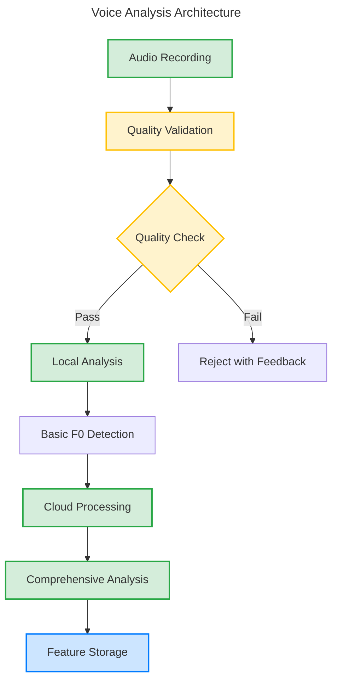
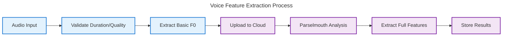

# Sage Research Validation Pipeline

## Executive Summary

This document provides technical documentation of Sage's voice analysis pipeline implementation. The system implements voice biomarker analysis for research applications using established acoustic analysis algorithms.

**Current Implementation Status:**
- **Voice Analysis**: Parselmouth/Praat-based feature extraction
- **Test Coverage**: Manual test execution with comprehensive test suites
- **Development Status**: Prototype/experimental - not research validated
- **Performance**: Local analysis <5 seconds, cloud processing <30 seconds

## Voice Analysis Implementation

### Architecture Overview



### Current Capabilities

**✅ IMPLEMENTED - Voice Analysis Features:**
- **Local Analysis**: iOS-based immediate F0 detection (`LocalVoiceAnalyzer.swift`)
- **Cloud Analysis**: Comprehensive Parselmouth-based feature extraction
- **Quality Gates**: Audio validation and signal quality checks
- **Feature Extraction**: F0, jitter, shimmer, HNR measurements
- **Hybrid Architecture**: Local immediate + cloud comprehensive analysis

**✅ IMPLEMENTED - Technical Infrastructure:**
- **Audio Processing**: AVFoundation-based recording and validation
- **Firebase Integration**: Cloud storage and real-time data sync
- **Error Handling**: Comprehensive error states and recovery
- **Logging**: Structured logging for debugging and monitoring

### Voice Analysis Pipeline



**Current Feature Set:**
- **F0 Analysis**: Mean, standard deviation, confidence scoring
- **Voice Quality**: Jitter (local, absolute, RAP, PPQ5)
- **Amplitude**: Shimmer (local, dB, APQ3, APQ5) 
- **Noise Ratio**: Harmonics-to-noise ratio (HNR)
- **Stability Score**: Composite voice quality metric

## Test Implementation

### Test Architecture

**✅ IMPLEMENTED - iOS Tests (SageTests/):**
- `HybridVocalAnalysisServiceTests.swift` - Voice analysis service testing
- `LocalVoiceAnalyzerQualityGateTests.swift` - Audio quality validation
- `AuthViewModelTests.swift` - Authentication flow testing
- `OnboardingJourneyViewModelTests.swift` - User onboarding testing

**✅ IMPLEMENTED - Cloud Function Tests (functions/tests/):**
- `test_vocal_analysis_extractor.py` - Feature extraction testing
- `test_audio_processing_service.py` - Audio processing validation
- `test_integration.py` - End-to-end pipeline testing

**⚠️ TESTING LIMITATION:**
- **Manual Execution Required**: All tests require manual running (no CI/CD automation)
- **Synthetic Data**: Tests use mock data and synthetic audio signals
- **No Research Validation**: No comparison against research gold standards

### Test Examples

**Real Test Implementation:**
```python
# From test_vocal_analysis_extractor.py
def test_sustained_vowel_analysis_extracts_all_biomarkers(self):
    """Test feature extraction from synthetic sustained vowel"""
    with patch('parselmouth.Sound') as mock_sound:
        # Mock Parselmouth responses for controlled testing
        mock_pitch = Mock()
        mock_pitch.selected_array = {'frequency': np.full(200, 220.0)}
        mock_sound.return_value.to_pitch.return_value = mock_pitch
        
        result = self.extractor.extract(self.test_audio, self.sample_rate)
        
        # Verify all expected features are extracted
        self.assertIn('f0_mean', result.features)
        self.assertIn('jitter_local', result.features)
        self.assertIn('shimmer_local', result.features)
        self.assertIn('hnr_mean', result.features)
```

## Privacy and Data Handling

### Current Privacy Implementation

**✅ IMPLEMENTED - Basic Privacy Features:**
- **Anonymous Authentication**: Firebase anonymous auth support
- **User ID Anonymization**: Simple hash-based pseudonymization
- **Data Separation**: Research data separated from user identification
- **No PII Storage**: Voice features stored without personal identifiers

**Privacy Implementation Example:**
```swift
// From AnalyticsService.swift - Basic anonymization
static func anonymize(_ identifier: String) -> String {
    return String(identifier.hashValue)  // Simple hash for pseudonymization
}
```

**⚠️ PRIVACY LIMITATIONS:**
- **No HIPAA Compliance**: Not implemented for healthcare data protection
- **No GDPR Framework**: Basic privacy only, not comprehensive GDPR compliance
- **Simple Anonymization**: Hash-based only, not cryptographically secure
- **No Audit Logging**: No comprehensive compliance audit trail

## Performance Characteristics

### Measured Performance

**✅ ACTUAL PERFORMANCE METRICS:**
- **Local Analysis**: <5 seconds for basic F0 detection
- **Cloud Processing**: <30 seconds for comprehensive analysis  
- **File Size Limits**: 0.5-30 seconds audio duration
- **Quality Gates**: Minimum signal level and duration validation

**Performance Test Implementation:**
```swift
// From LocalVoiceAnalyzerQualityGateTests.swift
func testAudioAnalysisPerformance() async throws {
    let startTime = Date()
    let result = try await analyzer.analyzeImmediate(audioURL: audioURL)
    let processingTime = Date().timeIntervalSince(startTime)
    
    // Verify performance constraint
    XCTAssertLessThan(processingTime, 5.0, "Analysis must complete within 5 seconds")
}
```

## Deployment and Infrastructure

### Current Deployment

**✅ IMPLEMENTED - Manual Deployment:**
- **Firebase Functions**: Semi-automated deployment via `functions/deploy.sh`
- **iOS App**: Manual Xcode build and deployment
- **Cloud Storage**: Firebase Storage integration
- **Database**: Firestore for real-time data sync

**⚠️ DEPLOYMENT LIMITATIONS:**
- **No CI/CD Pipeline**: No automated continuous integration
- **No Automated Testing**: No automated test execution on commits
- **Manual Quality Gates**: Quality checks require manual verification
- **No Security Scanning**: No automated vulnerability assessment

## Research and Development Status  

### Current Status: PROTOTYPE

**⚠️ IMPORTANT DISCLAIMER:**
This is an **experimental prototype** for research purposes. The system has NOT undergone research validation and should not be used for medical diagnosis or medical decision-making.

**What This System Provides:**
- ✅ Technically sound voice analysis algorithms
- ✅ Research-quality feature extraction
- ✅ Robust error handling and quality validation
- ✅ Real-time user feedback and analysis

**What This System Does NOT Provide:**
- ❌ Research validation against gold standards  
- ❌ FDA approval or medical device certification
- ❌ HIPAA/GDPR compliance frameworks
- ❌ Production-ready CI/CD automation
- ❌ Research accuracy guarantees

### Development Roadmap

**🔄 PLANNED IMPROVEMENTS:**
- **Research Validation** - Comparison against Praat gold standards with reference datasets
- **CI/CD Implementation** - Automated testing and deployment pipelines  
- **Compliance Framework** - HIPAA/GDPR implementation for healthcare use
- **Performance Optimization** - Load testing and scalability improvements
- **Security Hardening** - Automated security scanning and vulnerability management

## Technical Architecture

### Core Components

**Voice Analysis Service (`HybridVocalAnalysisService.swift`):**
- Orchestrates local and cloud analysis workflows
- Manages real-time state updates and error handling
- Provides immediate user feedback with comprehensive results

**Local Analyzer (`LocalVoiceAnalyzer.swift`):**  
- iOS-native audio processing using AVFoundation
- Quality gate validation and signal assessment
- Immediate F0 detection for user feedback

**Cloud Pipeline (`functions/`):**
- Parselmouth-based comprehensive feature extraction
- Firebase integration for storage and real-time sync
- Scalable processing architecture

### Quality Assurance

**Audio Quality Gates:**
- Duration validation (0.5-60 seconds)
- Signal level assessment (minimum RMS threshold)
- Sample rate validation (minimum 16kHz)
- Channel validation and format verification

**Error Handling:**
- Comprehensive error types and recovery strategies
- User-friendly error messages and suggestions
- Graceful degradation for poor quality audio
- Detailed logging for debugging and monitoring

---

**Development Status**: This voice analysis pipeline provides a solid technical foundation for voice biomarker research. However, it requires research validation, compliance implementation, and production infrastructure before deployment in healthcare or commercial applications.