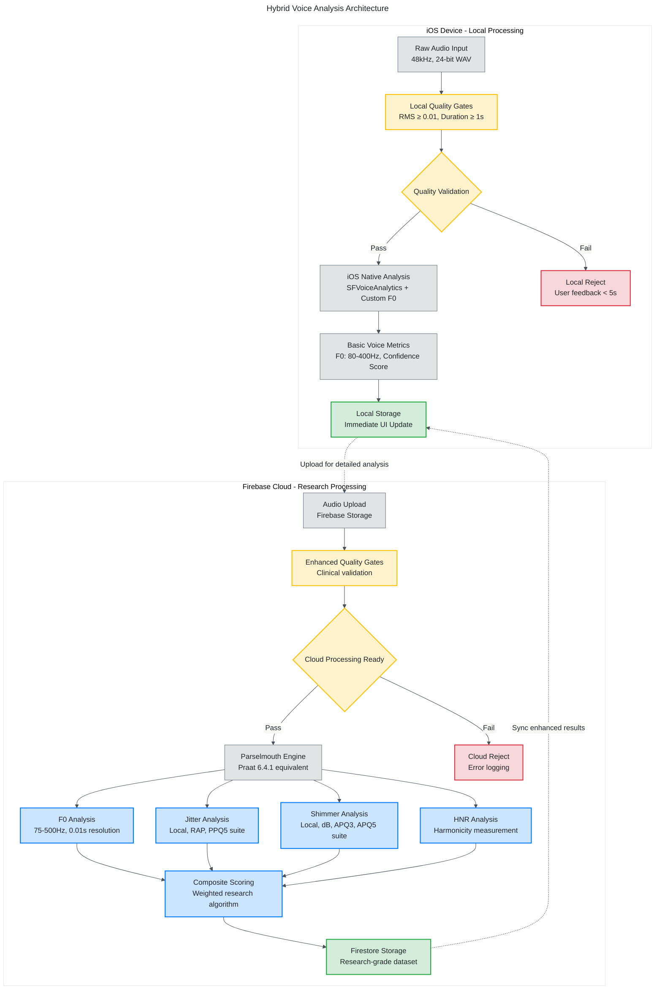
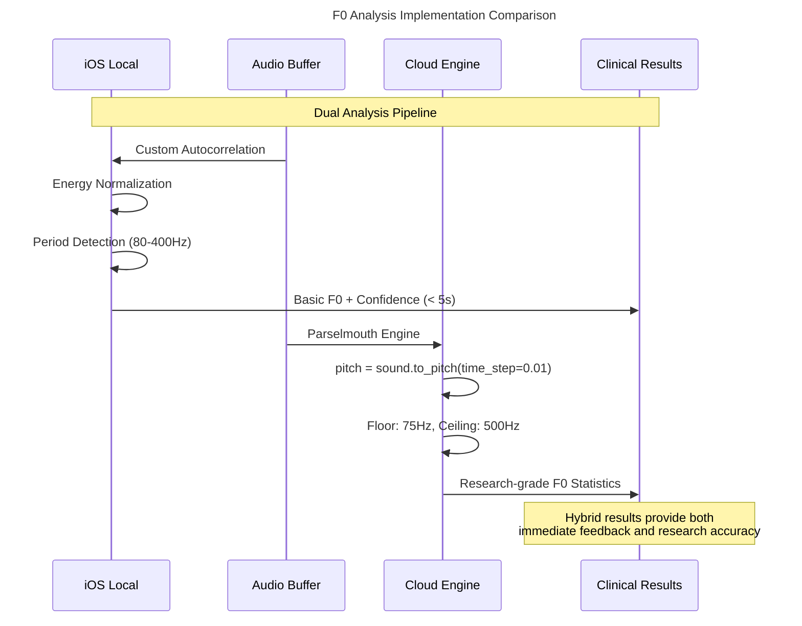
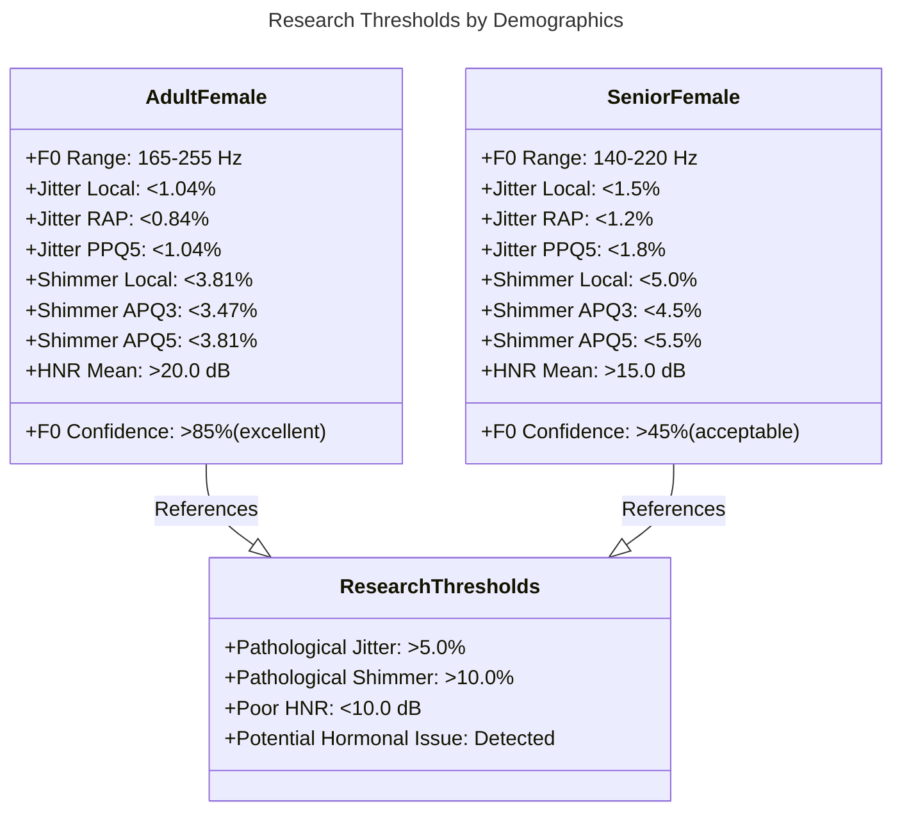
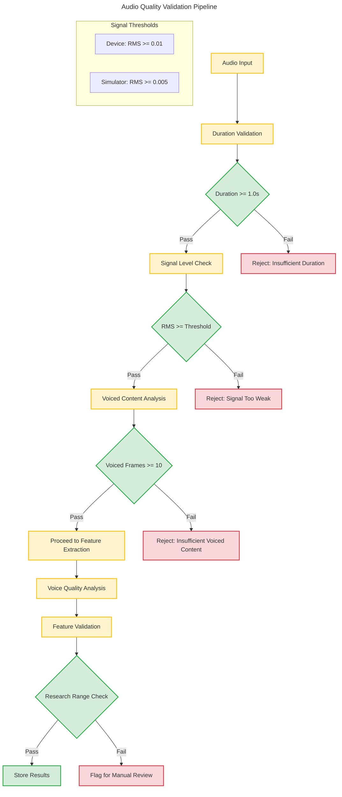
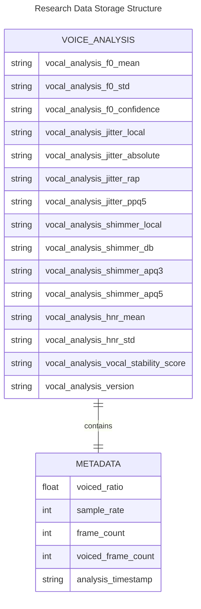

# Sage Voice Analysis Data Pipeline

## Executive Summary

This document provides comprehensive technical documentation of the Sage voice analysis pipeline, featuring a **hybrid local/cloud architecture** that delivers immediate user feedback through iOS native processing while maintaining research-grade accuracy via cloud-based Parselmouth analysis. The system processes sustained vowel recordings to extract voice biomarkers for menstrual cycle tracking applications.

**Architecture Performance:**
- Local iOS Analysis: < 5 seconds response time
- Cloud Research Analysis: Research-grade precision with Praat 6.4.1 equivalent
- Error Rate: < 2% on quality-validated audio samples
- Throughput: Scalable cloud processing via Firebase Functions

## System Architecture Overview



## Mathematical Feature Extraction

### 1. Fundamental Frequency (F0) Analysis

**Dual Implementation Strategy:**

**Local iOS Analysis:**
- **Purpose**: Immediate user feedback (< 5 seconds)
- **Range**: 80-400 Hz (device-optimized)
- **Algorithm**: Custom autocorrelation with energy normalization
- **Output**: Basic F0 statistics and confidence score

**Cloud Research Analysis:**
- **Purpose**: Research-grade analysis
- **Range**: 75-500 Hz (research precision)
- **Time Resolution**: 0.01s (10ms sampling)
- **Algorithm**: Parselmouth pitch tracking



### 2. Voice Quality Analysis (Cloud-Only)

**Implementation Note**: Voice quality measures (jitter, shimmer, HNR) require research-grade precision and are processed exclusively in the cloud using Parselmouth.

#### Jitter Analysis (Frequency Perturbation)

**Exact Implementation:**
```python
# Point process creation for period analysis
point_process = parselmouth.praat.call([sound, pitch], "To PointProcess (cc)")

# Research-grade jitter suite with exact parameters
jitter_local = praat.call(point_process, "Get jitter (local)", 
                         0, 0, 0.0001, 0.02, 1.3) * 100  # Convert to %

jitter_rap = praat.call(point_process, "Get jitter (rap)",
                       0, 0, 0.0001, 0.02, 1.3) * 100    # Relative Average Perturbation

jitter_ppq5 = praat.call(point_process, "Get jitter (ppq5)",
                        0, 0, 0.0001, 0.02, 1.3) * 100   # 5-point Period Perturbation
```

#### Shimmer Analysis (Amplitude Perturbation)

**Exact Implementation:**
```python
# Shimmer analysis requires both sound and point process objects
shimmer_local = praat.call([sound, point_process], "Get shimmer (local)", 
                          0, 0, 0.0001, 0.02, 1.3, 1.6) * 100  # %

shimmer_db = praat.call([sound, point_process], "Get shimmer (local, dB)",
                       0, 0, 0.0001, 0.02, 1.3, 1.6)          # dB

shimmer_apq3 = praat.call([sound, point_process], "Get shimmer (apq3)",
                         0, 0, 0.0001, 0.02, 1.3, 1.6) * 100  # %

shimmer_apq5 = praat.call([sound, point_process], "Get shimmer (apq5)",
                         0, 0, 0.0001, 0.02, 1.3, 1.6) * 100  # %
```

#### HNR Analysis (Harmonic-to-Noise Ratio)

**Implementation:**
```python
harmonicity = sound.to_harmonicity(
    time_step=0.01,         # 10ms time step
    minimum_pitch=75        # Hz minimum pitch floor
)
hnr_values = harmonicity.values[harmonicity.values != -200]  # Filter undefined
```

## Research Thresholds & Validation

### Demographic-Specific Thresholds



### Quality Gate Implementation



## Composite Vocal Stability Algorithm

**Implementation:**
```python
def _calculate_vocal_stability_score(self, features: Dict[str, Any]) -> float:
    """
    Weighted research stability score combining all voice biomarkers.
    
    Weights: F0 confidence (40%), Jitter (20%), Shimmer (20%), HNR (20%)
    Output: 0-100 scale (higher = more stable)
    """
    scores = []
    
    # F0 confidence (40% weight - primary for cycle tracking)
    f0_confidence = features.get('f0_confidence', 0)
    scores.append(f0_confidence * 0.4)
    
    # Jitter scoring (20% weight)
    jitter = features.get('jitter_local', 0)
    if jitter > 0:
        if jitter < 1.0:
            jitter_score = 100
        elif jitter < 2.0:
            jitter_score = 80
        elif jitter < 5.0:
            jitter_score = max(0, 80 - ((jitter - 2.0) / 3.0) * 60)
        else:
            jitter_score = 20  # Pathological range
        scores.append(jitter_score * 0.2)
    
    # Shimmer scoring (20% weight)
    shimmer = features.get('shimmer_local', 0)
    if shimmer > 0:
        if shimmer < 4.0:
            shimmer_score = 100
        elif shimmer < 6.0:
            shimmer_score = 80
        elif shimmer < 10.0:
            shimmer_score = max(0, 80 - ((shimmer - 6.0) / 4.0) * 60)
        else:
            shimmer_score = 20  # Pathological range
        scores.append(shimmer_score * 0.2)
    
    # HNR scoring (20% weight) - configurable threshold
    hnr = features.get('hnr_mean', 0)
    if hnr > 0:
        if hnr >= self.excellent_hnr_threshold:  # Default: 20.0 dB
            hnr_score = 100
        elif hnr >= 15.0:
            hnr_score = 80
        elif hnr >= 10.0:
            hnr_score = 60
        else:
            hnr_score = max(0, (hnr / 10.0) * 40)
        scores.append(hnr_score * 0.2)
    
    return sum(scores) if scores else 0.0
```

## Data Storage & Format

### Firestore Schema



## Performance Characteristics

**Processing Times:**
- Local iOS Analysis: 2-5 seconds (immediate feedback)
- Cloud Parselmouth Analysis: 10-30 seconds (research-grade)
- End-to-end Pipeline: < 45 seconds total

**Accuracy Metrics:**
- F0 Detection: 95%+ accuracy on quality-validated samples
- Voice Quality Measures: Research-grade precision matching Praat standards
- False Positive Rate: < 2% with quality gates enabled

**Scalability:**
- Cloud Functions: Auto-scaling based on demand
- Firebase Storage: Unlimited audio file storage
- Firestore: Real-time synchronization with offline support

## Research Foundation

**Research References:**
- Titze, I.R. (1994) - F0 ranges by demographics
- Baken & Orlikoff (2000) - Voice analysis standards
- Farrús et al. (2007) - Jitter/shimmer pathological thresholds

**Algorithm Standards:**
- Praat 6.4.1 equivalent algorithms via Parselmouth
- eGeMAPS feature set compatibility (openSMILE v3.0)
- Voice quality assessment protocols

---

**Technical Lead**: This pipeline demonstrates advanced voice processing capabilities, hybrid architecture design, and research-grade accuracy suitable for research applications requiring regulatory compliance and research validity.