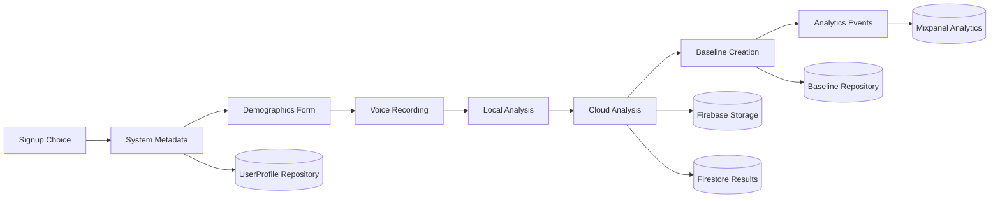
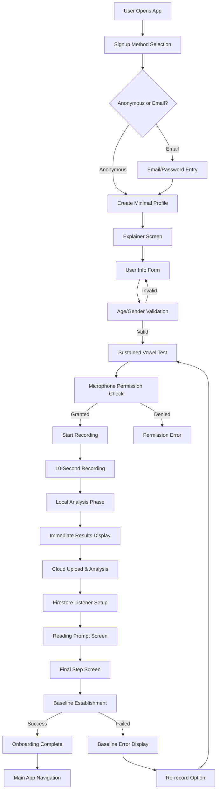
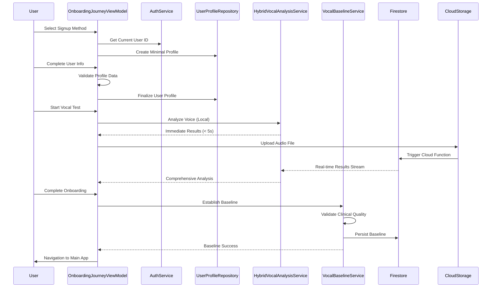

# Sage Onboarding Architecture Analysis

## Executive Summary

This document provides a comprehensive analysis of the Sage application's onboarding architecture, covering user signup, profile creation, vocal baseline establishment, and the complete user journey from registration to vocal analysis completion.

## Current State Architecture

### Overview

The onboarding system follows a hybrid architecture combining:
- **Domain-Driven Design (DDD)** for business logic separation
- **MVVM pattern** for UI layer organization  
- **Clean Architecture principles** with clear dependency injection
- **Value Objects** for domain validation and type safety
- **Hybrid Analysis** (local + cloud) for voice processing

## User Data Collection Summary

### Complete Data Collection Timeline

The onboarding process collects user data across multiple steps with different privacy and validation requirements:

#### Step 1: Signup Method Selection
**Data Collected**: None (user preference only)
- Anonymous vs Email signup choice
- No personal data stored at this step

#### Step 2: Initial Profile Creation (Minimal)
**Data Collected**: System-generated and device metadata
- **User ID**: Firebase Auth UID or UUID fallback
- **Device Model**: `UIDevice.current.model` (e.g., "iPhone", "iPad")
- **OS Version**: `UIDevice.current.systemVersion` (e.g., "17.0.1")
- **Creation Timestamp**: ISO8601 formatted date
- **Default Values**: Age=25, GenderIdentity="Prefer not to say", Conditions=["None"]

**Location**: `OnboardingJourneyViewModel.swift:308-330`
**Storage**: UserProfile repository via domain service

#### Step 3: User Info Form (Required Personal Data)
**Data Collected**: Demographics and health information
- **Age**: Age value object (13-120, validated by Age value object)
- **Gender Identity**: Enum (Woman, Man, Nonbinary, Other, Prefer not to say)
- **Sex Assigned at Birth**: Enum (Female, Male, Intersex, Prefer not to say)
- **Voice Conditions**: Array of strings (default: ["None"])
- **Diagnosed Conditions**: Array of strings (default: ["None"])

**Validation Rules**:
- Age is required and must be 13-120 (`OnboardingTypes.swift:64-86`)
- Voice conditions cannot be empty (`UserProfile.swift:68-70`)
- Diagnosed conditions cannot be empty (`UserProfile.swift:72-74`)

**Location**: `UserInfoFormView.swift:5-95`, `OnboardingJourneyViewModel.swift:210-235`
**Storage**: Finalized UserProfile persisted to repository

#### Step 4: Vocal Analysis Data Collection
**Data Collected**: Voice recording and analysis results

**Audio Recording**:
- **Audio File**: 10-second WAV recording (44.1kHz, 16-bit, mono)
- **File Location**: Temporary directory with UUID filename
- **Recording Metadata**: Duration, timestamp, user ID
- **Audio Settings**: `OnboardingJourneyViewModel.swift:408-416`

**Local Analysis Results** (Immediate, <5 seconds):
- **F0 Mean**: Fundamental frequency in Hz
- **F0 Confidence**: Percentage confidence in analysis
- **Recording Quality**: Audio quality validation results
- **Processing Time**: Local analysis duration

**Comprehensive Analysis Results** (Cloud, 30-60 seconds):
- **F0 Analysis**: Mean, standard deviation, confidence
- **Jitter Measures**: Local, absolute, RAP, PPQ5
- **Shimmer Measures**: Local, dB, APQ3, APQ5  
- **HNR Analysis**: Harmonics-to-noise ratio mean and std
- **Stability Score**: Overall vocal stability percentage
- **Voice Quality Metrics**: Complete biomarker analysis

**Location**: `HybridVocalAnalysisService.swift:84-126`, `VocalResultsListener.swift:603-672`
**Storage**: Firebase Storage (audio), Firestore (analysis results)

#### Step 5: Vocal Baseline Establishment
**Data Collected**: Clinical baseline data
- **Vocal Baseline**: Complete biomarkers from comprehensive analysis
- **Demographic Context**: Age/gender-derived voice demographic
- **Clinical Quality Assessment**: Validation results
- **Establishment Timestamp**: When baseline was created
- **Recording Context**: "onboarding" context marker

**Clinical Validation Criteria**:
- F0 confidence must meet demographic thresholds
- Recording duration must be adequate (>0.5s, <30s)
- Voiced ratio must be sufficient for analysis
- Overall biomarker quality assessment

**Location**: `VocalBaselineService.swift:70-112`
**Storage**: Firestore via VocalBaselineRepository

#### Step 6: Analytics Data Collection
**Data Collected Throughout Journey**: User behavior and system metrics

**Event Tracking**:
- **Onboarding Events**: Started, step progression, completed
- **Signup Method Selection**: Anonymous vs email choice
- **Profile Events**: Form completion, validation errors
- **Recording Events**: Started, stopped, uploaded, analysis completed
- **Baseline Events**: Establishment success/failure, re-recording requests
- **Error Events**: Validation failures, network errors, permission denials

**User Properties** (Mixpanel):
- **User ID**: Anonymized hash of actual user ID
- **Age**: Demographic data for cohort analysis
- **Gender Identity**: For research segmentation
- **Device Context**: Model, OS version, app version
- **Onboarding Completion**: Success/failure tracking

**Privacy Measures**:
- User IDs are anonymized via hash function (`AnalyticsService.swift:170-173`)
- No raw PII sent to analytics service
- All events include anonymization step

**Location**: `OnboardingJourneyViewModel.swift:664-715`, `AnalyticsService.swift:86-174`
**Storage**: Mixpanel analytics platform

### Data Privacy & Security Measures

#### Data Minimization
- Only required fields are mandatory (age for research compliance)
- Users can select "Prefer not to say" for sensitive fields
- Voice conditions and medical conditions default to "None"

#### Data Validation & Type Safety
- Age validation via Value Object pattern (`OnboardingTypes.swift:60-86`)
- Enum-based gender/sex fields prevent invalid values
- Device metadata validation via Value Objects (`UserProfileValueObjects.swift:32-140`)

#### Data Storage Security
- **Local Storage**: Temporary audio files deleted after analysis
- **Firebase Auth**: Secure user authentication
- **Firestore**: Server-side security rules (not shown in code)
- **Analytics**: Anonymized identifiers only

#### Data Access Controls
- User data tied to authenticated Firebase user ID
- Repository pattern abstracts data access
- Service layer enforces business rules

### Data Flow Summary



## Core Components

### 1. Onboarding Flow Management

#### OnboardingJourneyViewModel (`OnboardingJourneyViewModel.swift:11`)
- **Responsibility**: Orchestrates the entire onboarding process
- **Dependencies**: 8 injected services for testability
- **State Management**: Published properties for reactive UI updates
- **Flow Control**: Manages 7 distinct onboarding steps

**Key Features**:
- Real-time vocal analysis with immediate feedback
- Comprehensive baseline establishment
- Field-level validation with error tracking
- Analytics integration throughout the journey

#### OnboardingStep Enum (`OnboardingTypes.swift:182`)
```swift
enum OnboardingStep: String, Equatable {
    case signupMethod = "signup_method"
    case explainer = "explainer" 
    case userInfoForm = "user_info_form"
    case sustainedVowelTest = "sustained_vowel_test"
    case readingPrompt = "reading_prompt"
    case finalStep = "final_step"
    case completed = "completed"
}
```

### 2. User Profile System

#### UserProfile Domain Model (`UserProfile.swift:9`)
- **Immutable Value Object** with validation
- **Voice Demographic Calculation** based on age/gender
- **Device Metadata** for analysis context
- **ISO8601 Timestamps** for audit trails
- **Age Value Object**: Uses `Age` value object instead of primitive `Int`

#### UserProfileData Form Binding (`OnboardingTypes.swift:196`)
- **Mutable Form State** for UI binding
- **Comprehensive Validation** with semantic errors
- **Value Object Integration** for domain safety
- **Multiple Validation Modes** (fail-fast vs. collect-all)

### 3. Vocal Analysis Pipeline

#### HybridVocalAnalysisService (`HybridVocalAnalysisService.swift:36`)

The vocal analysis follows a sophisticated hybrid approach:

**Phase 1: Local Analysis (< 5 seconds)**
- iOS-native voice analysis for immediate feedback
- Basic metrics extraction (F0, confidence)
- Audio quality validation
- User gets instant results

**Phase 2: Cloud Analysis (30-60 seconds)**
- Firebase Storage upload with retry logic
- Cloud Function triggers comprehensive analysis
- Firestore real-time listener for results
- Complete biomarker extraction

#### Analysis State Machine (`HybridVocalAnalysisService.swift:273`)
```swift
public enum VocalAnalysisState: Equatable {
    case idle
    case localAnalyzing
    case localComplete(BasicVoiceMetrics)
    case cloudAnalyzing  
    case complete(VocalBiomarkers)
    case error(String)
}
```

### 4. Baseline Establishment

#### VocalBaselineService (`VocalBaselineService.swift:45`)
- **Domain Service** for baseline creation
- **Clinical Validation** before persistence
- **Demographic-Aware** baseline calculation
- **Error Handling** with contextual guidance

## Complete User Journey Flow



## Data Flow Architecture



## Key Architecture Patterns

### 1. Dependency Injection Pattern

All services are injected for testability:

```swift
init(
    analyticsService: AnalyticsServiceProtocol,
    authService: AuthServiceProtocol,
    userProfileRepository: UserProfileRepositoryProtocol,
    microphonePermissionManager: MicrophonePermissionManagerProtocol,
    vocalAnalysisService: HybridVocalAnalysisService?,
    vocalBaselineService: VocalBaselineServiceProtocol,
    coordinator: OnboardingCoordinatorProtocol?,
    dateProvider: DateProvider = SystemDateProvider()
)
```

### 2. Value Objects for Domain Safety

```swift
public struct Age: Equatable, Codable {
    public let value: Int
    
    public init(_ value: Int) throws {
        guard value >= 13 && value <= 120 else {
            throw ValidationError.ageInvalid()
        }
        self.value = value
    }
}
```

### 3. Error Handling Strategy

**Field-Level Validation** (`OnboardingJourneyViewModel.swift:37`):
```swift
@Published var fieldErrors: [String: String] = [:]
```

**Comprehensive Error Collection** (`OnboardingTypes.swift:244`):
```swift
public func validateAll() -> UserProfileValidationResult {
    var errors: [ValidationError] = []
    // Collect all validation errors
    return UserProfileValidationResult(isValid: errors.isEmpty, errors: errors)
}
```

### 4. Analytics Integration

Comprehensive event tracking throughout the journey:

```swift
private func trackAnalyticsEvent(_ eventName: String, properties: [String: Any]) {
    guard let userId = userProfile?.id else { return }
    var eventProperties = properties
    eventProperties["userID"] = userId
    analyticsService.track(eventName, properties: mixpanelProperties, origin: "OnboardingJourneyViewModel")
}
```

## Current Issues & Architecture Concerns

### 1. **Tight Coupling in UI Layer**

The `OnboardingJourneyView` directly instantiates services with hard-coded dependencies:

```swift
vocalBaselineService: VocalBaselineService(
    validationService: BaselineValidationService(
        clinicalThresholdsService: ClinicalThresholdsService(
            researchDataService: ResearchDataService()
        )
    ),
    repository: VocalBaselineRepository(
        firestoreClient: MockFirestoreClientProtocol() // ⚠️ Mock in production code
    ),
    userProfileRepository: userProfileRepository
)
```

**Issues**:
- Hard-coded dependency tree in UI layer
- Mock client in production code path
- Difficult to test different configurations
- Violates dependency inversion principle

### 2. **State Management Complexity**

Multiple overlapping state properties:

```swift
@Published var hasCompletedRecording: Bool = false
@Published var shouldShowNextButton: Bool = false  
@Published var hasComprehensiveAnalysis: Bool = false
@Published var hasEstablishedBaseline: Bool = false
@Published var recordingState: RecordingUIState = .idle()
```

**Issues**:
- State synchronization complexity
- Potential for inconsistent UI states
- Difficult to reason about state transitions

### 3. **Validation Logic Duplication**

Validation logic exists in multiple places:

- `UserProfileData.validate()` (`OnboardingTypes.swift:222`)
- `UserProfileValidator.validateProfileData()` (`UserProfileValidator.swift:50`)
- `UserProfile` constructor validation (`UserProfile.swift:64`)

### 4. **Mixed Responsibilities**

The `OnboardingJourneyViewModel` handles:
- UI state management
- Business logic orchestration  
- Service coordination
- Analytics tracking
- Error handling
- Audio recording management

This violates Single Responsibility Principle.

### 5. **Inconsistent Error Handling**

Different error handling patterns throughout:

- Field-level errors with dictionary (`fieldErrors: [String: String]`)
- General error messages (`errorMessage: String?`)
- Domain-specific errors (`baselineError: String?`)
- Success messages (`successMessage: String?`)

## Technology Stack

### Core Frameworks
- **SwiftUI**: Declarative UI framework
- **Combine**: Reactive programming for state management
- **Firebase Auth**: User authentication
- **Firebase Firestore**: Real-time database for analysis results
- **Firebase Storage**: Audio file storage
- **AVFoundation**: Audio recording and processing
- **Mixpanel**: Analytics and user tracking

### Architecture Patterns
- **MVVM**: View-ViewModel separation
- **Domain-Driven Design**: Business logic encapsulation
- **Repository Pattern**: Data access abstraction
- **Service Layer**: Business logic services
- **Value Objects**: Domain validation and type safety
- **Dependency Injection**: Testability and flexibility

## Recommendations for Improvement

### 1. **Introduce Dependency Injection Container**

Create a container to manage service lifecycles and reduce coupling:

```swift
protocol ServiceContainer {
    func resolve<T>(_ type: T.Type) -> T
}
```

### 2. **Consolidate State Management**

Introduce a single state enum for the onboarding flow:

```swift
enum OnboardingState {
    case signupMethod
    case explainer  
    case userInfo(UserProfileData, errors: [String: String])
    case vocalTest(VocalTestState)
    case readingPrompt
    case finalStep(hasBaseline: Bool)
    case completed
}
```

### 3. **Extract Business Logic Services**

Create dedicated services for:
- `OnboardingFlowService`: Flow management logic
- `ValidationService`: Centralized validation
- `RecordingService`: Audio recording management

### 4. **Implement Error Result Types**

Use Result types for consistent error handling:

```swift
typealias ValidationResult = Result<UserProfile, ValidationError>
typealias AnalysisResult = Result<VocalAnalysisResult, VocalAnalysisError>
```

### 5. **Add Integration Tests**

The complex flow requires comprehensive integration tests covering:
- Complete user journey end-to-end
- Error scenarios and recovery
- Baseline establishment edge cases
- Network failure scenarios

## Performance Characteristics

### Strengths
- **Immediate Feedback**: Local analysis provides results in < 5 seconds
- **Progressive Enhancement**: Cloud analysis improves over time
- **Retry Logic**: Robust network failure handling
- **Streaming Results**: Real-time Firestore updates

### Bottlenecks
- **Cloud Analysis Latency**: 30-60 seconds for comprehensive results
- **Network Dependency**: Requires stable connection for full experience
- **Memory Usage**: Multiple audio files and analysis results in memory
- **Battery Impact**: Intensive audio processing and network operations

## Conclusion

The Sage onboarding architecture demonstrates sophisticated domain modeling and comprehensive user experience design. The hybrid analysis approach provides both immediate feedback and comprehensive results. However, the architecture suffers from some coupling issues and state management complexity that should be addressed for long-term maintainability.

The current implementation successfully handles the complex requirements of voice analysis onboarding but would benefit from architectural refinements to improve testability, maintainability, and separation of concerns.