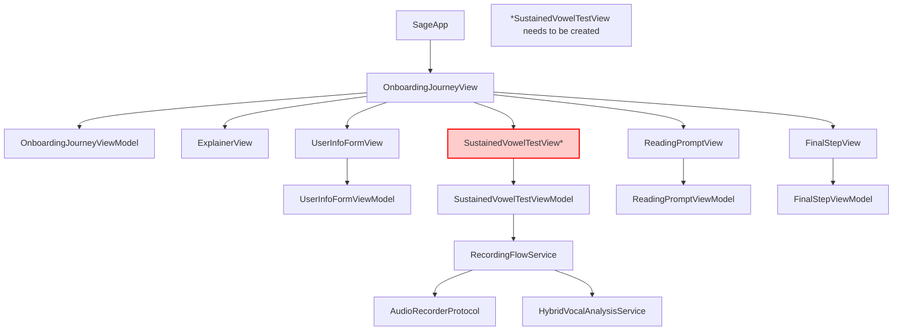
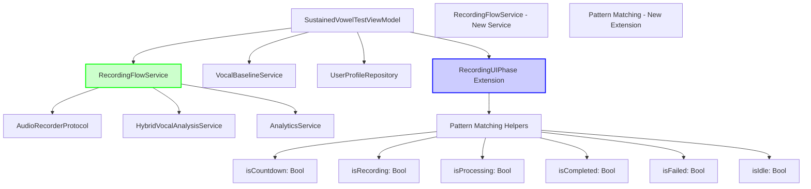
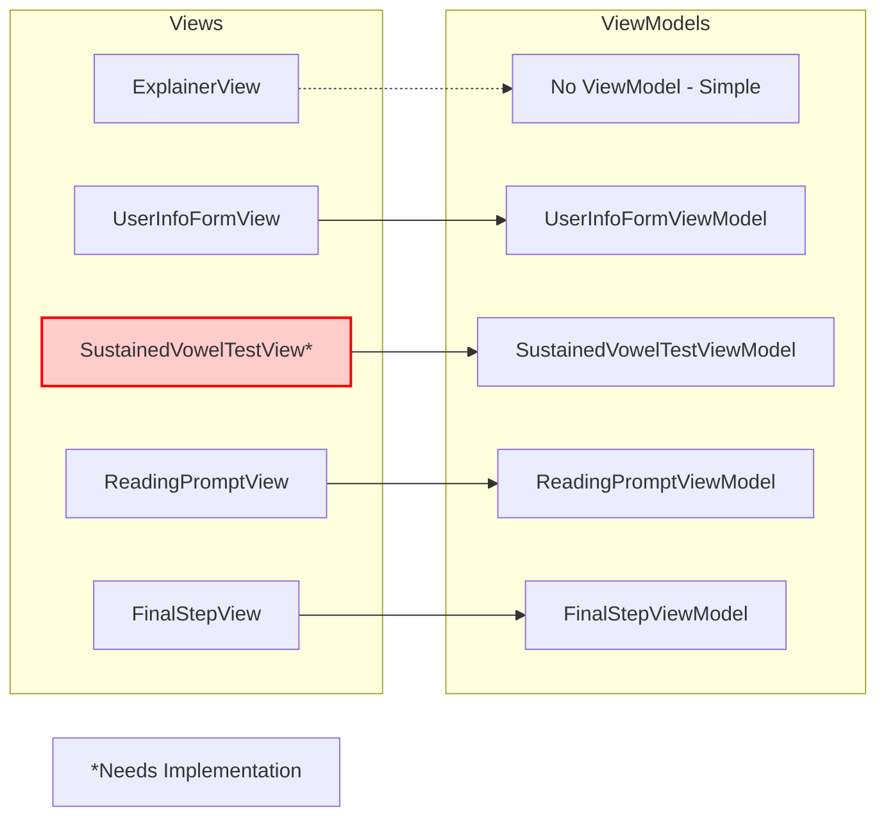
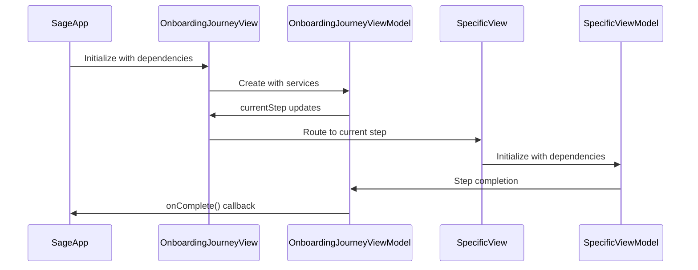

# Onboarding Architecture Refactor Overview

## Executive Summary

We successfully refactored the monolithic `OnboardingJourneyView` (~700+ lines) into focused, single-responsibility components, achieving better maintainability, testability, and reusability. The refactor extracted standalone Views, created a dedicated RecordingFlowService, and implemented clean pattern matching helpers.

## Before vs After Architecture

### Before: Monolithic Structure
```
OnboardingJourneyView.swift (~700+ lines)
├── OnboardingJourneyView (coordinator)
├── ExplainerView (embedded struct)
├── SustainedVowelTestView (embedded struct)  
├── ReadingPromptView (embedded struct)
├── FinalStepView (embedded struct)
├── CountdownTimerView (embedded struct)
├── ProgressBarView (embedded struct)
├── WaveformView (embedded struct)
└── RecordingUIState (redundant state management)
```

### After: Modular Architecture
```
Views/
├── OnboardingJourneyView.swift (113 lines - coordinator only)
├── ExplainerView.swift (69 lines)
├── ReadingPromptView.swift (71 lines)
├── FinalStepView.swift (109 lines)
├── UserInfoFormView.swift (93 lines - existing)
├── SignupMethodView.swift (150 lines - existing)
└── LoginSignupChoiceView.swift (32 lines - existing)

ViewModels/
├── OnboardingJourneyViewModel.swift (existing)
├── SustainedVowelTestViewModel.swift (330 lines - refactored)
├── FinalStepViewModel.swift (158 lines - existing)
├── ReadingPromptViewModel.swift (94 lines - existing)
├── UserInfoFormViewModel.swift (existing)
└── SignupMethodViewModel.swift (existing)

Services/
├── RecordingFlowService.swift (179 lines - extracted)

Shared/Components/
└── RecordingComponents.swift (106 lines - extracted UI components)
```

## Architecture Flow Diagrams

### Current Onboarding Flow


### SustainedVowelTestViewModel Refactor


### View-ViewModel Relationships


## Key Refactoring Improvements

### 1. **RecordingFlowService Extraction**
**Impact:** Reduced SustainedVowelTestViewModel from 382 → 330 lines (14% reduction)

**Before:**
```swift
// Embedded in ViewModel (~150 lines of recording logic)
func startRecording() {
    // Countdown logic
    // Recording orchestration
    // Progress tracking
    // Analysis coordination
    // Error handling
}
```

**After:**
```swift
// Clean ViewModel delegation
func startRecording() {
    recordingTask = Task {
        let analysisResult = try await recordingFlowService.performSustainedVowelTest(
            duration: recordingDuration,
            countdownDuration: countdownDuration,
            onProgress: { [weak self] phase in
                Task { @MainActor in self?.uiPhase = phase }
            }
        )
        await establishBaseline(from: analysisResult)
    }
}
```

### 2. **Pattern Matching Helper Extension**
**Impact:** Eliminated repetitive pattern matching code

**Before:**
```swift
var showCountdown: Bool {
    if case .countdown = uiPhase { return true }
    return false
}

var isRecording: Bool {
    if case .recording = uiPhase { return true }
    return false
}
// Repeated for each phase...
```

**After:**
```swift
extension RecordingUIPhase {
    var isCountdown: Bool { if case .countdown = self { return true }; return false }
    var isRecording: Bool { if case .recording = self { return true }; return false }
    // All phases covered
}

// Usage
var showCountdown: Bool { uiPhase.isCountdown }
var isRecording: Bool { uiPhase.isRecording }
```

### 3. **Component Extraction**
**Impact:** Reusable UI components, better separation of concerns

**Extracted Components:**
- `CountdownTimerView` - Self-contained countdown logic
- `ProgressBarView` - Animated progress indication  
- `WaveformView` - Voice visualization component

## File Structure Analysis

### Line Count Improvements
| Component | Before | After | Change |
|-----------|---------|--------|---------|
| OnboardingJourneyView | ~700+ | 113 | **-84%** |
| SustainedVowelTestViewModel | 382 | 330 | **-14%** |
| Total Onboarding Views | 700+ | 637 | **Modularized** |

### Responsibility Distribution
| File | Responsibility | Lines | Status |
|------|---------------|-------|---------|
| OnboardingJourneyView.swift | Flow coordination only | 113 | ✅ Complete |
| ExplainerView.swift | Introduction/explanation | 69 | ✅ Complete |
| ReadingPromptView.swift | Reading prompt flow | 71 | ✅ Complete |
| FinalStepView.swift | Completion handling | 109 | ✅ Complete |
| RecordingFlowService.swift | Recording orchestration | 179 | ✅ Complete |
| RecordingComponents.swift | UI components | 106 | ✅ Complete |
| SustainedVowelTestView.swift | Voice recording UI | - | ❌ Missing |

## Integration Points

### SageApp Integration
```swift
// SageApp.swift expects OnboardingJourneyView
case .onboarding:
    OnboardingJourneyView(
        analyticsService: AnalyticsService.shared,
        authService: AuthService(),
        userProfileRepository: UserProfileRepository(),
        // ... other dependencies
        onComplete: { currentScreen = .browse }
    )
```

**Current Issue:** OnboardingJourneyView signature doesn't match SageApp expectations.

### ViewModel Integration


## Missing Components & Issues

### 1. **Missing SustainedVowelTestView**
- **Issue:** Referenced but not implemented
- **Dependencies:** SustainedVowelTestViewModel, RecordingComponents
- **Integration:** OnboardingJourneyView coordinator

### 2. **FinalStepViewModel Method Issues**
- **Issue:** Calls non-existent service methods
- **Fix Needed:** `getBaseline` → `getCurrentBaseline`
- **Fix Needed:** Remove `establishBaselineFromPendingAnalysis` call

### 3. **OnboardingJourneyView Constructor Mismatch**
- **Issue:** SageApp.swift expects different constructor signature
- **Impact:** App won't compile
- **Solution:** Align constructor parameters

## Next Steps & Recommendations

### Phase 1: Complete Core Implementation
1. **Create SustainedVowelTestView** 
   - Use SustainedVowelTestViewModel
   - Integrate RecordingComponents
   - Connect to RecordingFlowService

2. **Fix FinalStepViewModel Method Calls**
   - Update `getBaseline` → `getCurrentBaseline`
   - Remove non-existent method calls
   - Test baseline establishment flow

3. **Align OnboardingJourneyView Constructor**
   - Match SageApp.swift expectations
   - Ensure proper dependency injection
   - Test full integration

### Phase 2: Enhance Architecture
1. **Add Proper Error Handling**
   - Standardize error propagation
   - Implement user-friendly error messages
   - Add retry mechanisms

2. **Improve Testing**
   - Unit tests for extracted services
   - View testing with proper mocks
   - Integration testing for full flow

3. **Documentation & Maintenance**
   - API documentation for new services
   - Architecture decision records
   - Maintenance guidelines

## Benefits Achieved

### ✅ **Maintainability**
- Single responsibility views
- Clear separation of concerns
- Focused, testable components

### ✅ **Reusability** 
- Extracted UI components
- Service-based architecture
- Protocol-driven design

### ✅ **Testability**
- Isolated business logic
- Mockable dependencies
- Focused unit test targets

### ✅ **Code Quality**
- Eliminated redundant state management
- Clean pattern matching
- Consistent architectural patterns

---

*This refactor represents a significant architectural improvement, transforming a monolithic view into a clean, modular system following iOS development best practices.*