# Sage User Journey Documentation

This document provides a comprehensive visual overview of all user journeys through the Sage voice analysis platform. It maps the actual implemented flows, view transitions, and user interactions to help developers and stakeholders understand the complete user experience.

**Document Status**: This document reflects the actual implementation as of January 2025. All flows, views, and interactions are based on the current codebase.

## App Entry Point & Authentication Flow

### Main App Navigation Structure
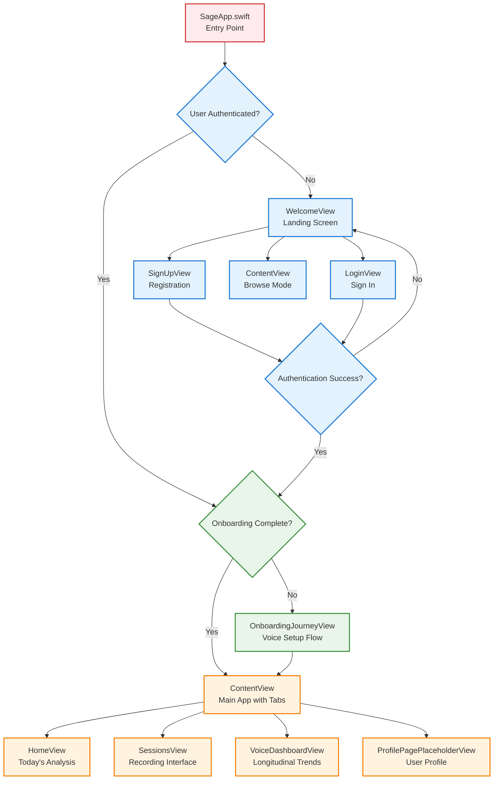

## Authentication Journey

### Sign Up Flow
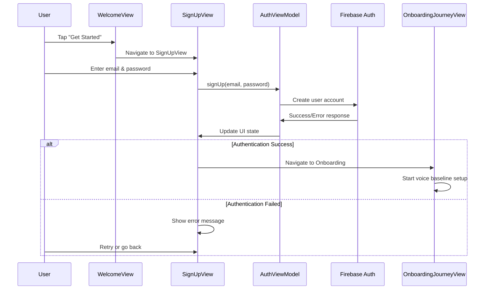

### Login Flow
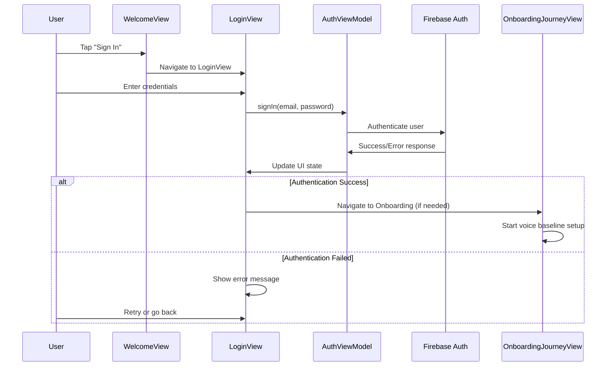

## Onboarding Journey

### Complete Onboarding Flow
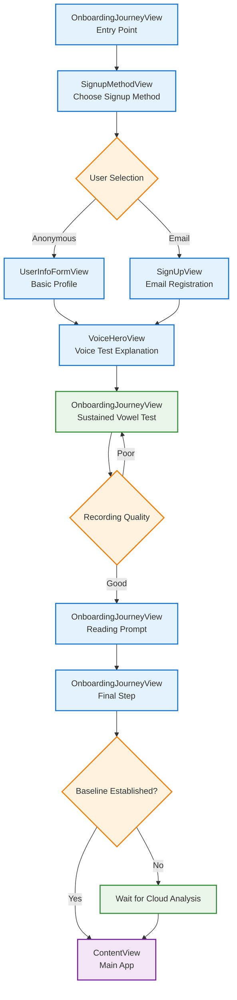

### Voice Recording Process
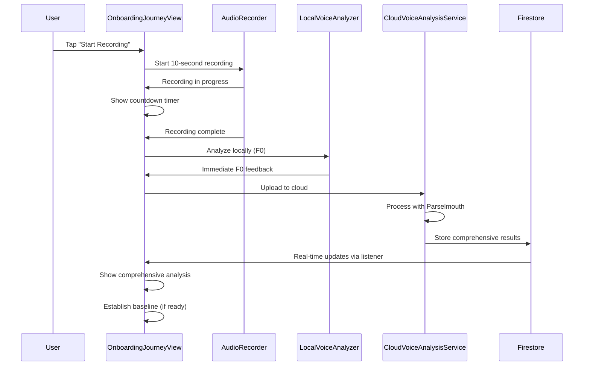

## Main App Journey

### Tab Navigation Structure
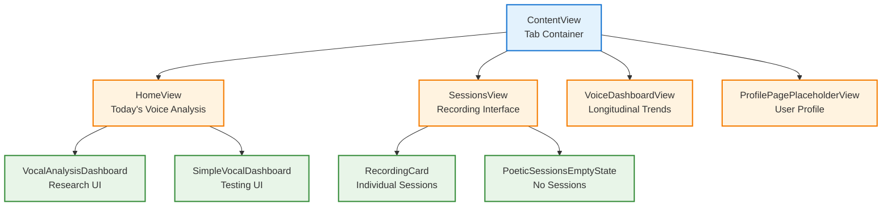

### Home View Journey
```mermaid
graph TD
    A[HomeView<br/>Entry Point] --> B{Has Recent Analysis?}
    B -->|Yes| C[Show Today's Results<br/>F0, Jitter, Shimmer, HNR]
    B -->|No| D[Show Empty State<br/>"Record your voice today"]
    
    C --> E[VocalAnalysisDashboard<br/>Research Interface]
    C --> F[SimpleVocalDashboard<br/>Testing Interface]
    
    E --> G[Show Percentile Bars<br/>Voice Quality Metrics]
    E --> H[Show Clinical Assessment<br/>Stability Score]
    
    F --> I[Show Basic Metrics<br/>F0, Quality Score]
    
    classDef home fill:#e3f2fd,stroke:#1976d2,stroke-width:2px
    classDef content fill:#fff3e0,stroke:#f57c00,stroke-width:2px
    classDef display fill:#e8f5e8,stroke:#388e3c,stroke-width:2px
    
    class A home
    class B,C,D content
    class E,F,G,H,I display
```

### Sessions View Journey
```mermaid
graph TD
    A[SessionsView<br/>Entry Point] --> B{Has Recordings?}
    B -->|Yes| C[Show Recording Cards<br/>List of past sessions]
    B -->|No| D[PoeticSessionsEmptyState<br/>"Start your voice journey"]
    
    C --> E[RecordingCard<br/>Individual Session]
    E --> F[Show Session Details<br/>Date, Duration, Quality]
    E --> G[Show Analysis Results<br/>F0, Jitter, Shimmer, HNR]
    
    A --> H[Tap Record Button]
    H --> I[Start New Recording<br/>5-second sustained vowel]
    I --> J[Local Analysis<br/>Immediate F0 feedback]
    I --> K[Cloud Upload<br/>Comprehensive analysis]
    K --> L[Real-time Updates<br/>Via Firestore listener]
    L --> C
    
    classDef sessions fill:#e3f2fd,stroke:#1976d2,stroke-width:2px
    classDef content fill:#fff3e0,stroke:#f57c00,stroke-width:2px
    classDef recording fill:#e8f5e8,stroke:#388e3c,stroke-width:2px
    
    class A sessions
    class B,C,D,E,F,G content
    class H,I,J,K,L recording
```

## Error Handling & Edge Cases

### Authentication Error Flow
```mermaid
graph TD
    A[Authentication Attempt] --> B{Success?}
    B -->|Yes| C[Proceed to Onboarding/App]
    B -->|No| D[Show Error Message]
    
    D --> E{Error Type}
    E -->|Invalid Credentials| F[Show "Invalid email or password"]
    E -->|Network Error| G[Show "Check internet connection"]
    E -->|Email in Use| H[Show "Email already registered"]
    E -->|Unknown| I[Show "Unexpected error occurred"]
    
    F --> J[User Retry]
    G --> J
    H --> J
    I --> J
    
    J --> A
    
    classDef error fill:#ffebee,stroke:#d32f2f,stroke-width:2px
    classDef retry fill:#fff3e0,stroke:#f57c00,stroke-width:2px
    
    class D,E,F,G,H,I error
    class J retry
```

### Recording Quality Gate Flow
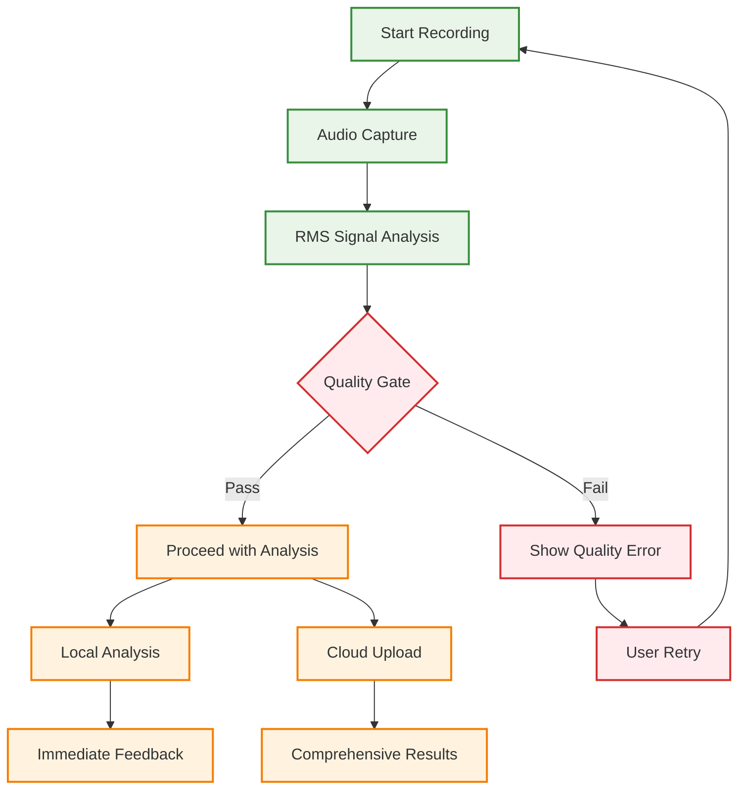

## User State Management

### Authentication State Flow
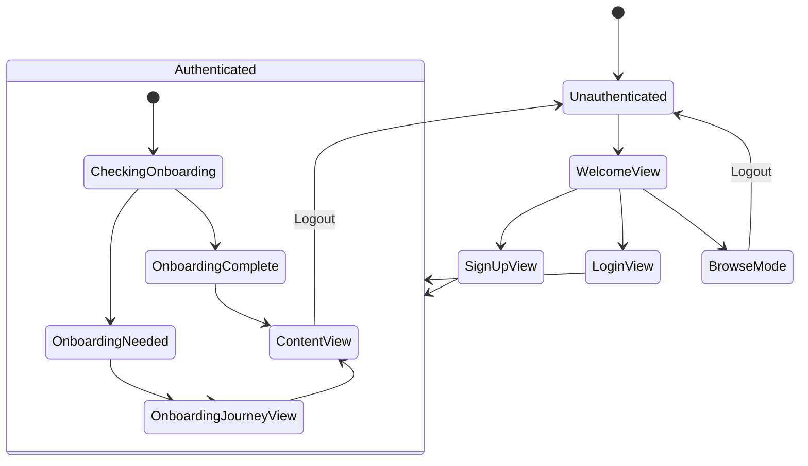

### Onboarding State Flow
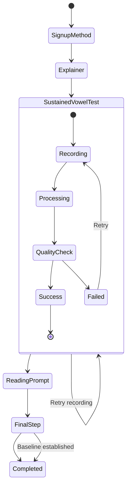

## View Hierarchy & Navigation

### Complete View Hierarchy
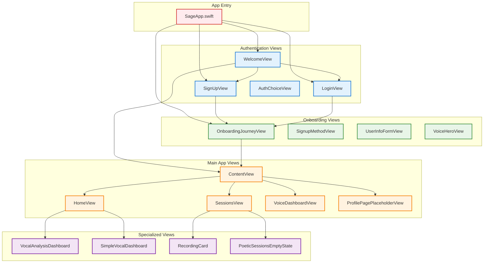

## Data Flow & State Management

### User Data Flow
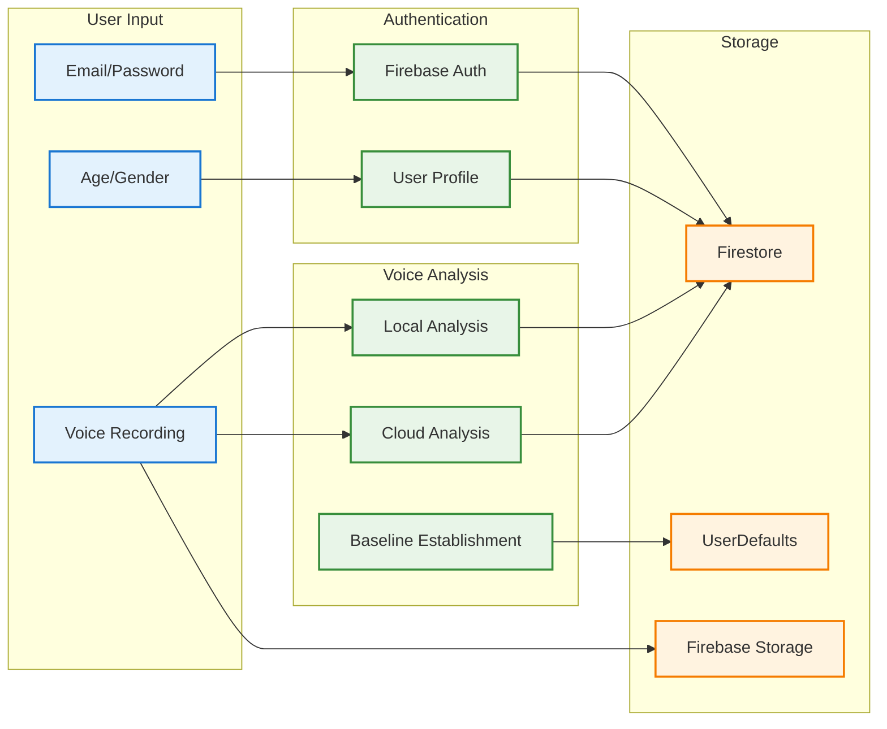

## Performance & User Experience

### Loading States & Feedback
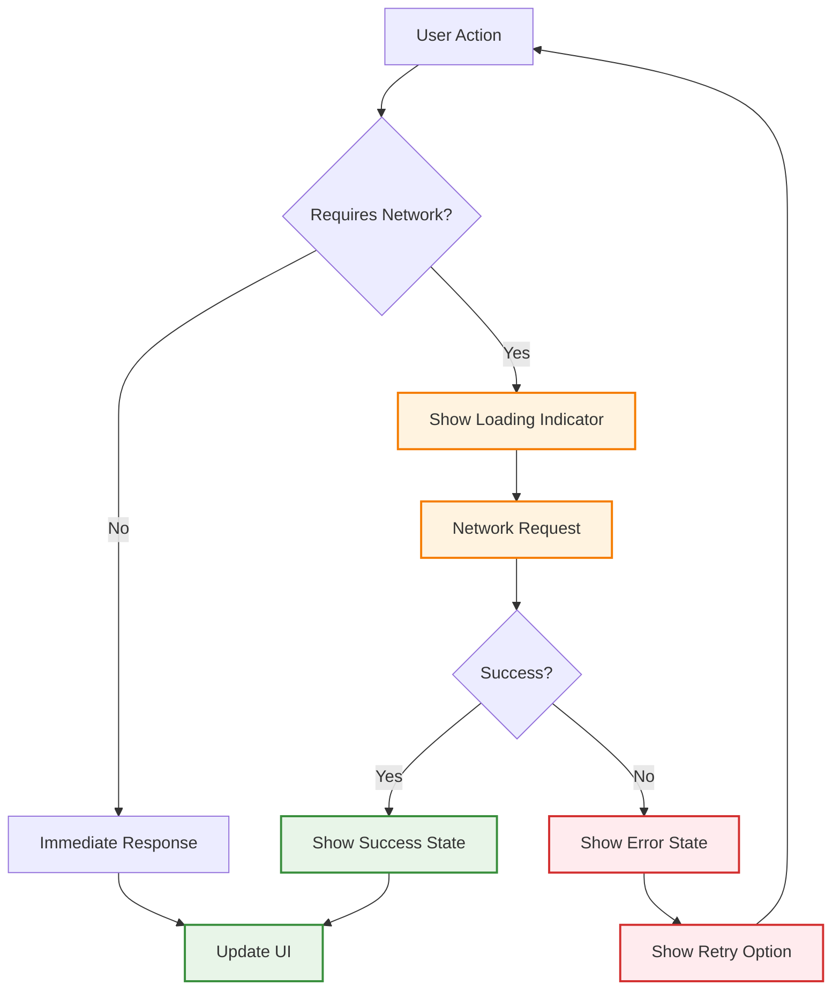

## Testing & Validation

### User Journey Testing
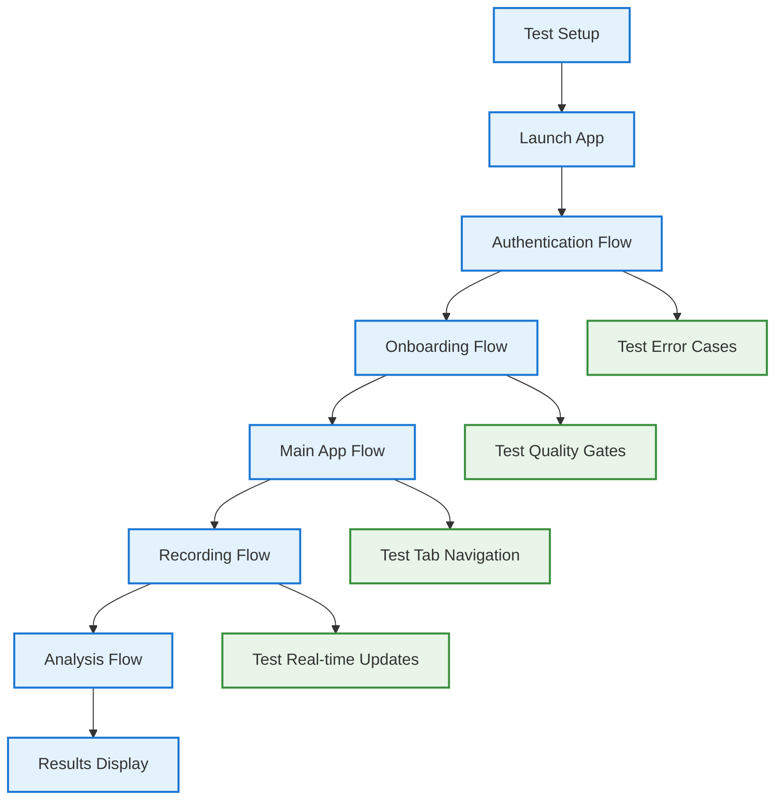

## Legend & Conventions

### View Types
| Symbol | View Type | Description |
|--------|-----------|-------------|
| 📱 | iOS Native | SwiftUI views and components |
| 🔐 | Authentication | Login, signup, and auth flows |
| 🎤 | Voice Recording | Audio capture and analysis |
| 📊 | Data Display | Results, charts, and metrics |
| ⚙️ | Settings | Configuration and preferences |

### Flow Types
| Symbol | Flow Type | Description |
|--------|-----------|-------------|
| ➡️ | Navigation | Screen transitions and routing |
| 🔄 | State Change | Data updates and UI refreshes |
| ⚡ | Real-time | Live updates and listeners |
| ❌ | Error Handling | Error states and recovery |

### Color Coding
- **Blue (#1976d2)**: Authentication and navigation flows
- **Green (#388e3c)**: Voice analysis and recording flows
- **Orange (#f57c00)**: Data display and results flows
- **Red (#d32f2f)**: Error states and edge cases
- **Purple (#7b1fa2)**: Settings and configuration flows

## Maintenance Guidelines

### When to Update This Document
1. **New user flows**: Adding new screens or navigation paths
2. **View changes**: Modifying existing view hierarchies
3. **State management**: Changes to authentication or data flow
4. **Error handling**: New error states or recovery flows
5. **Performance**: Loading states or user feedback changes

### How to Update
1. **Update diagrams**: Ensure Mermaid syntax is valid
2. **Test flows**: Verify navigation paths are accurate
3. **Document changes**: Add notes for significant updates
4. **Review with team**: Ensure all flows are represented
5. **Validate completeness**: Check that all views are included

### Mermaid Tips
- Use `graph TD` for top-down flow diagrams
- Use `sequenceDiagram` for interaction patterns
- Use `stateDiagram-v2` for state management
- Keep diagrams focused and readable
- Use consistent naming and color coding

---

**Maintainers**: This user journey document reflects the actual implementation and should be updated whenever user flows change. All diagrams are based on the current codebase and represent real user experiences. 