# Sage User Journey Documentation

This document provides a comprehensive visual overview of all user journeys through the Sage voice analysis platform. It maps the actual implemented flows, view transitions, and user interactions to help developers and stakeholders understand the complete user experience.

**Document Status**: This document reflects the actual implementation as of January 2025. All flows, views, and interactions are based on the current codebase.

## Authentication Journey

### Welcome Screen User Actions
```mermaid
graph TD
    A[WelcomeView<br/>"Women have always spoken."] --> B{User Action}
    
    B -->|Tap "Get Started"| C[SignUpView<br/>Registration Form]
    B -->|Tap "I already have an account"| D[LoginView<br/>Sign In Form]
    B -->|No action| E[Stay on WelcomeView]
    
    C --> F{Form Validation}
    F -->|Valid Email + Password ≥6 chars| G[Firebase Auth<br/>Create Account]
    F -->|Invalid Email| H[Show Error<br/>"Invalid email"]
    F -->|Password <6 chars| I[Show Error<br/>"Invalid password"]
    F -->|Tap "Continue Anonymously"| J[Anonymous Auth<br/>No credentials needed]
    
    D --> K{Form Validation}
    K -->|Valid Email + Password ≥6 chars| L[Firebase Auth<br/>Sign In]
    K -->|Invalid Email| M[Show Error<br/>"Invalid email"]
    K -->|Password <6 chars| N[Show Error<br/>"Invalid password"]
    
    G --> O{Authentication Success?}
    L --> O
    J --> O
    
    O -->|Success| P[Check Onboarding Status]
    O -->|Network Error| Q[Show Error<br/>"Check internet connection"]
    O -->|Email in Use| R[Show Error<br/>"Email already registered"]
    O -->|Unknown Error| S[Show Error<br/>"Unexpected error occurred"]
    
    Q --> T[User Retry]
    R --> T
    S --> T
    T --> C
    
    P --> U{Onboarding Complete?}
    U -->|No| V[OnboardingJourneyView<br/>Voice Setup Flow]
    U -->|Yes| W[ContentView<br/>Main App with Tabs]
    
    classDef welcome fill:#e3f2fd,stroke:#1976d2,stroke-width:2px
    classDef form fill:#fff3e0,stroke:#f57c00,stroke-width:2px
    classDef validation fill:#e8f5e8,stroke:#388e3c,stroke-width:2px
    classDef error fill:#ffebee,stroke:#d32f2f,stroke-width:2px
    classDef success fill:#f3e5f5,stroke:#7b1fa2,stroke-width:2px
    
    class A,B welcome
    class C,D,F,K form
    class G,H,I,J,L,M,N validation
    class O,P,Q,R,S,U error
    class V,W success
```

### Sign Up Flow with Requirements
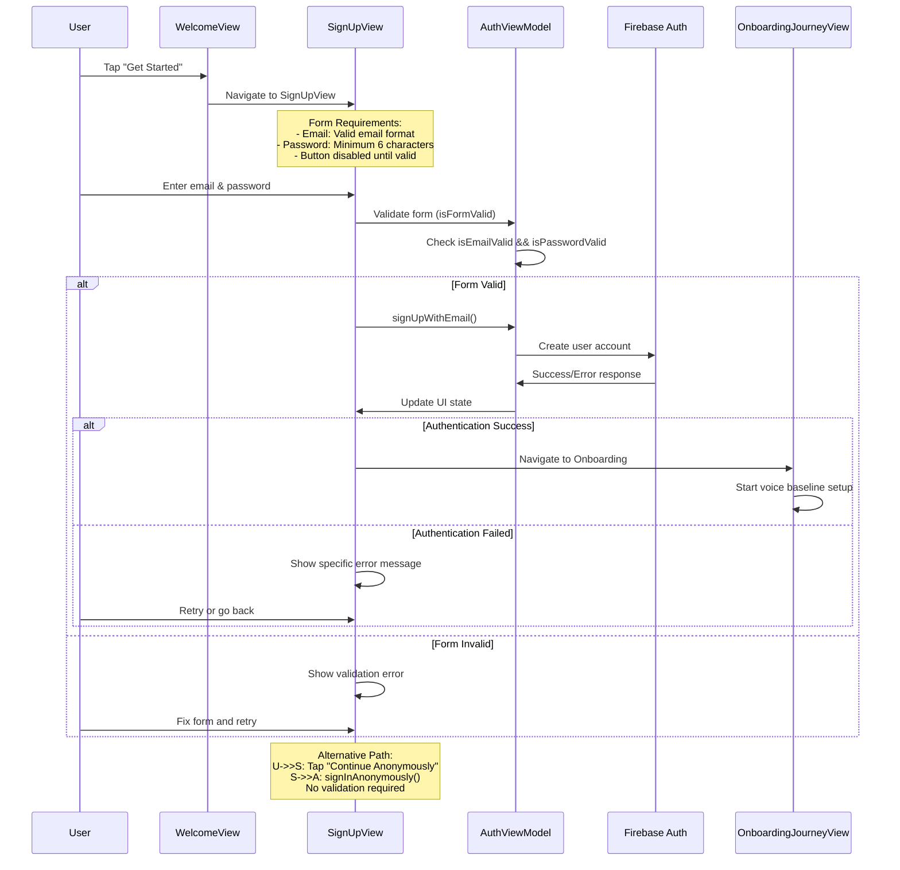

### Login Flow with Requirements
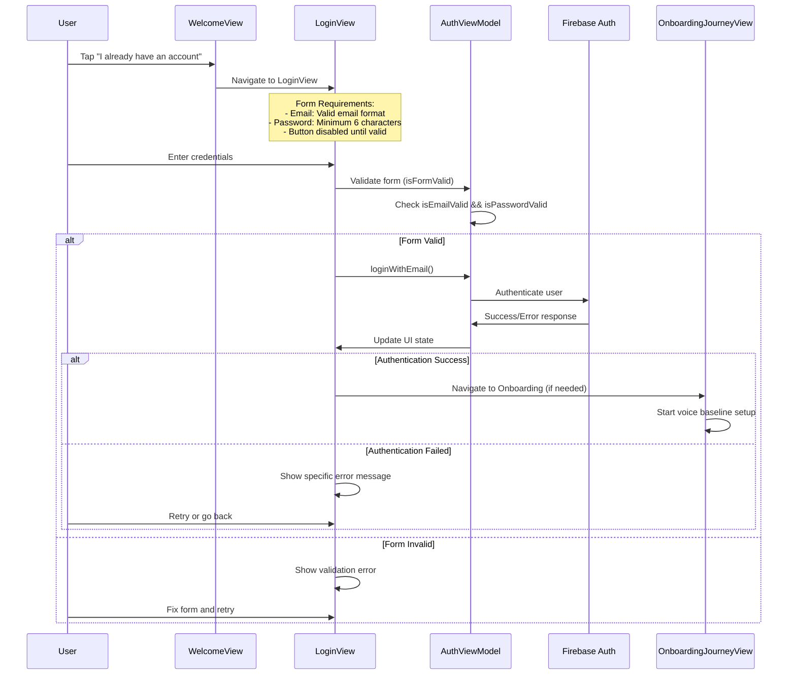

## Onboarding Journey

### Complete Onboarding Flow with Requirements
```mermaid
graph TD
    A[OnboardingJourneyView<br/>Entry Point] --> B[SignupMethodView<br/>Choose Signup Method]
    B --> C{User Selection}
    C -->|Tap "Anonymous"| D[UserInfoFormView<br/>Basic Profile]
    C -->|Tap "Email"| E[SignUpView<br/>Email Registration]
    
    D --> F[VoiceHeroView<br/>Voice Test Explanation]
    E --> F
    
    F --> G[OnboardingJourneyView<br/>Sustained Vowel Test]
    G --> H{Microphone Permission}
    H -->|Granted| I[Start 10-second Recording]
    H -->|Denied| J[Show Error<br/>"Microphone access required"]
    H -->|Restricted| K[Show Error<br/>"Microphone restricted"]
    
    I --> L{Recording Quality Gate}
    L -->|RMS ≥ Threshold| M[Proceed to Analysis]
    L -->|RMS < Threshold| N[Show Quality Error<br/>"Signal too weak"]
    
    M --> O[Local Analysis<br/>Immediate F0]
    M --> P[Cloud Upload<br/>Comprehensive Analysis]
    
    O --> Q[Show Immediate Results]
    P --> R[Real-time Updates<br/>Via Firestore Listener]
    
    Q --> S[OnboardingJourneyView<br/>Reading Prompt]
    R --> S
    
    S --> T[OnboardingJourneyView<br/>Final Step]
    T --> U{Baseline Established?}
    U -->|Yes| V[ContentView<br/>Main App]
    U -->|No| W[Wait for Cloud Analysis]
    W --> V
    
    N --> X[User Retry]
    X --> G
    
    classDef step fill:#e3f2fd,stroke:#1976d2,stroke-width:2px
    classDef decision fill:#fff3e0,stroke:#f57c00,stroke-width:2px
    classDef recording fill:#e8f5e8,stroke:#388e3c,stroke-width:2px
    classDef error fill:#ffebee,stroke:#d32f2f,stroke-width:2px
    classDef completion fill:#f3e5f5,stroke:#7b1fa2,stroke-width:2px
    
    class A,B,D,E,F,T step
    class C,H,L,U decision
    class G,I,M,O,P,Q,R,S recording
    class J,K,N,X error
    class V,W completion
```

### Voice Recording Process with Quality Gates
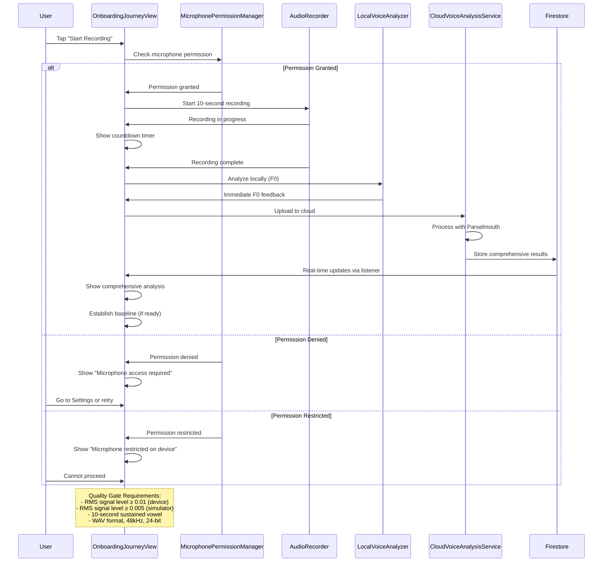

### Onboarding Step Requirements
```mermaid
graph TD
    A[OnboardingJourneyView<br/>Entry] --> B[SignupMethodView<br/>Choose Method]
    B --> C{User Action}
    C -->|Tap "Anonymous"| D[UserInfoFormView<br/>Age & Gender Required]
    C -->|Tap "Email"| E[SignUpView<br/>Email + Password ≥6 chars]
    
    D --> F[VoiceHeroView<br/>Explanation Screen]
    E --> F
    
    F --> G[OnboardingJourneyView<br/>Sustained Vowel Test]
    G --> H{Requirements Met?}
    
    H -->|Microphone Permission + Valid Audio| I[Proceed to Analysis]
    H -->|Missing Permission| J[Request Microphone Access]
    H -->|Poor Audio Quality| K[Show Quality Error]
    
    I --> L[Local Analysis<br/>Immediate F0]
    I --> M[Cloud Analysis<br/>Comprehensive Features]
    
    L --> N[OnboardingJourneyView<br/>Reading Prompt]
    M --> N
    
    N --> O[OnboardingJourneyView<br/>Final Step]
    O --> P{Baseline Ready?}
    P -->|Yes| Q[ContentView<br/>Main App]
    P -->|No| R[Wait for Cloud Results]
    R --> Q
    
    J --> S[User Grants Permission]
    S --> G
    K --> T[User Retry]
    T --> G
    
    classDef step fill:#e3f2fd,stroke:#1976d2,stroke-width:2px
    classDef requirement fill:#fff3e0,stroke:#f57c00,stroke-width:2px
    classDef validation fill:#e8f5e8,stroke:#388e3c,stroke-width:2px
    classDef error fill:#ffebee,stroke:#d32f2f,stroke-width:2px
    classDef completion fill:#f3e5f5,stroke:#7b1fa2,stroke-width:2px
    
    class A,B,D,E,F,N,O step
    class C,H,P requirement
    class G,I,L,M validation
    class J,K,S,T error
    class Q,R completion
```

## Main App Journey

### Tab Navigation Structure
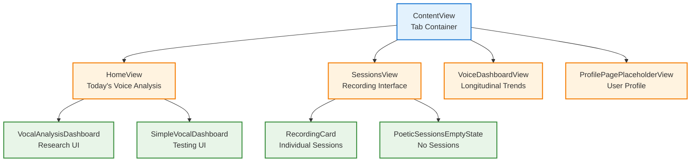

### Home View Journey
```mermaid
graph TD
    A[HomeView<br/>Entry Point] --> B{Has Recent Analysis?}
    B -->|Yes| C[Show Today's Results<br/>F0, Jitter, Shimmer, HNR]
    B -->|No| D[Show Empty State<br/>"Record your voice today"]
    
    C --> E[VocalAnalysisDashboard<br/>Research Interface]
    C --> F[SimpleVocalDashboard<br/>Testing Interface]
    
    E --> G[Show Percentile Bars<br/>Voice Quality Metrics]
    E --> H[Show Clinical Assessment<br/>Stability Score]
    
    F --> I[Show Basic Metrics<br/>F0, Quality Score]
    
    classDef home fill:#e3f2fd,stroke:#1976d2,stroke-width:2px
    classDef content fill:#fff3e0,stroke:#f57c00,stroke-width:2px
    classDef display fill:#e8f5e8,stroke:#388e3c,stroke-width:2px
    
    class A home
    class B,C,D content
    class E,F,G,H,I display
```

### Sessions View Journey
```mermaid
graph TD
    A[SessionsView<br/>Entry Point] --> B{Has Recordings?}
    B -->|Yes| C[Show Recording Cards<br/>List of past sessions]
    B -->|No| D[PoeticSessionsEmptyState<br/>"Start your voice journey"]
    
    C --> E[RecordingCard<br/>Individual Session]
    E --> F[Show Session Details<br/>Date, Duration, Quality]
    E --> G[Show Analysis Results<br/>F0, Jitter, Shimmer, HNR]
    
    A --> H[Tap Record Button]
    H --> I[Start New Recording<br/>5-second sustained vowel]
    I --> J[Local Analysis<br/>Immediate F0 feedback]
    I --> K[Cloud Upload<br/>Comprehensive analysis]
    K --> L[Real-time Updates<br/>Via Firestore listener]
    L --> C
    
    classDef sessions fill:#e3f2fd,stroke:#1976d2,stroke-width:2px
    classDef content fill:#fff3e0,stroke:#f57c00,stroke-width:2px
    classDef recording fill:#e8f5e8,stroke:#388e3c,stroke-width:2px
    
    class A sessions
    class B,C,D,E,F,G content
    class H,I,J,K,L recording
```

## Error Handling & Edge Cases

### Authentication Error Flow
```mermaid
graph TD
    A[Authentication Attempt] --> B{Success?}
    B -->|Yes| C[Proceed to Onboarding/App]
    B -->|No| D[Show Error Message]
    
    D --> E{Error Type}
    E -->|Invalid Credentials| F[Show "Invalid email or password"]
    E -->|Network Error| G[Show "Check internet connection"]
    E -->|Email in Use| H[Show "Email already registered"]
    E -->|Unknown| I[Show "Unexpected error occurred"]
    
    F --> J[User Retry]
    G --> J
    H --> J
    I --> J
    
    J --> A
    
    classDef error fill:#ffebee,stroke:#d32f2f,stroke-width:2px
    classDef retry fill:#fff3e0,stroke:#f57c00,stroke-width:2px
    
    class D,E,F,G,H,I error
    class J retry
```

### Recording Quality Gate Flow
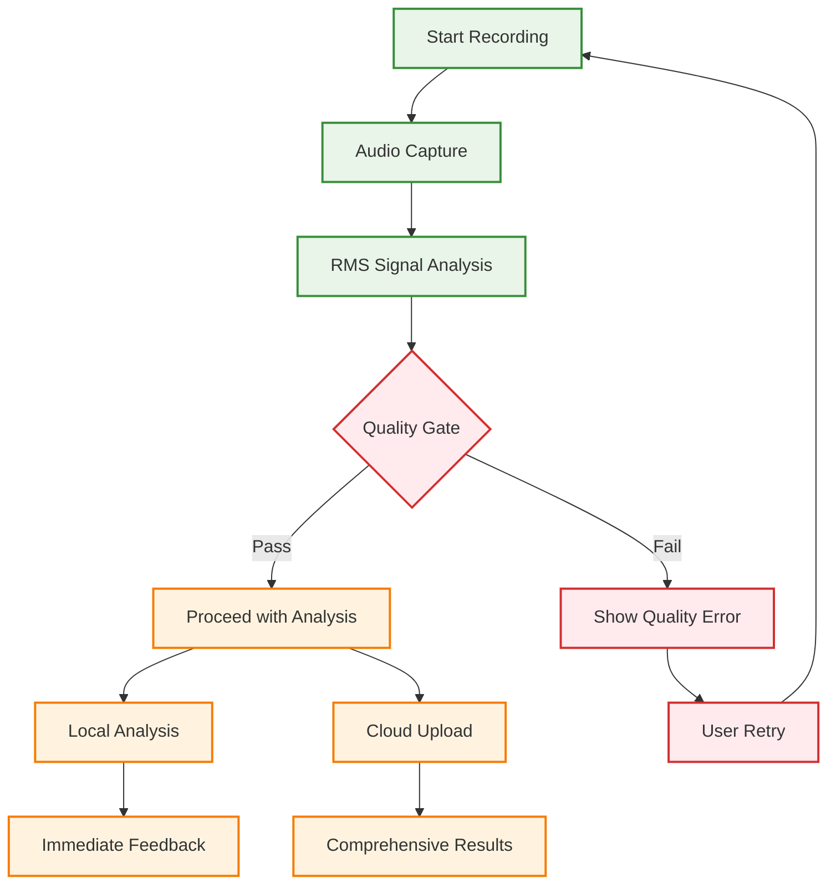

## User State Management

### Authentication State Flow
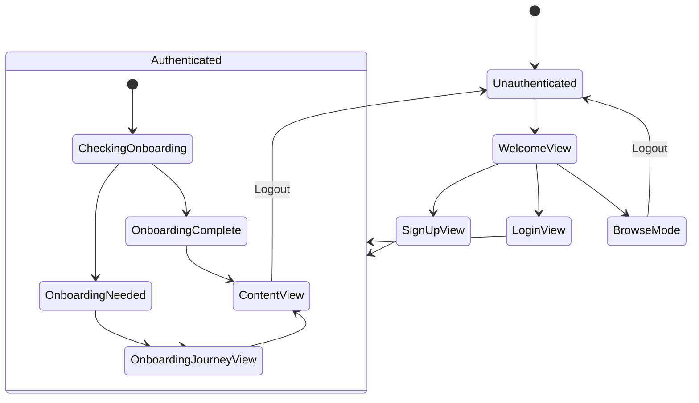

### Onboarding State Flow
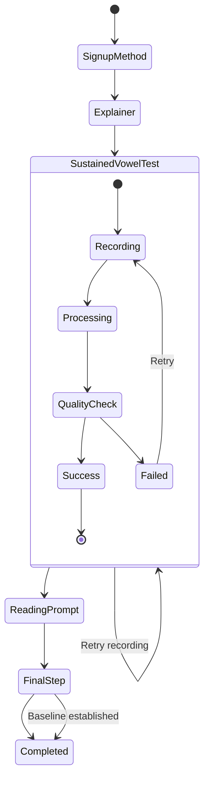

## View Hierarchy & Navigation

### Complete View Hierarchy
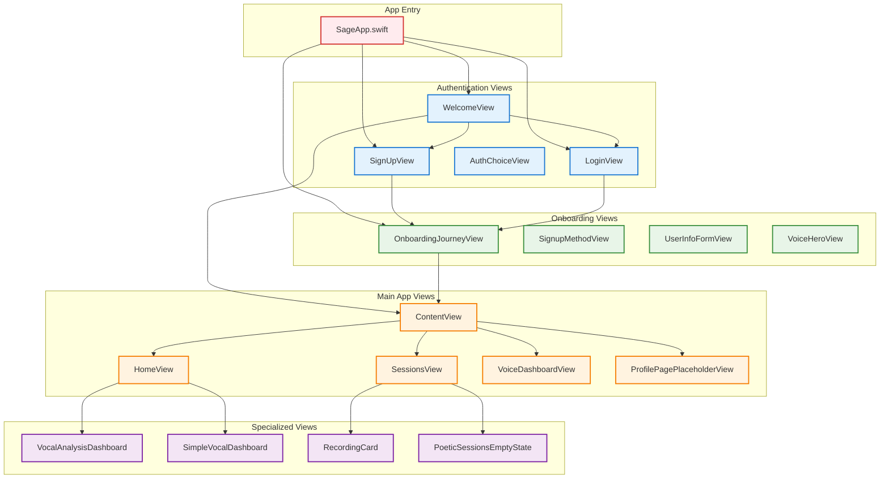

## Data Flow & State Management

### User Data Flow
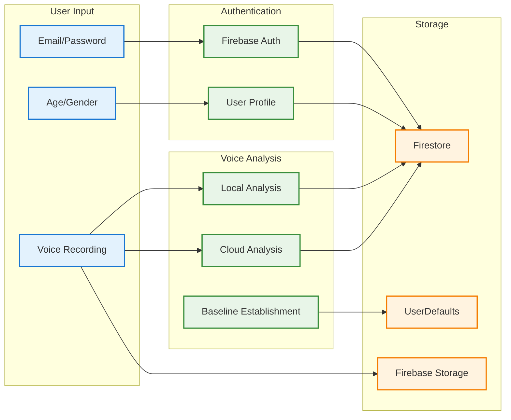

## Performance & User Experience

### Loading States & Feedback
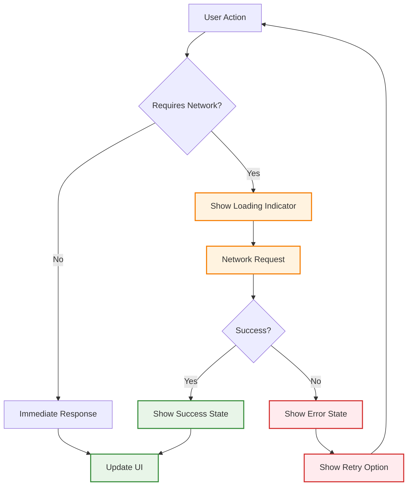

## Testing & Validation

### User Journey Testing
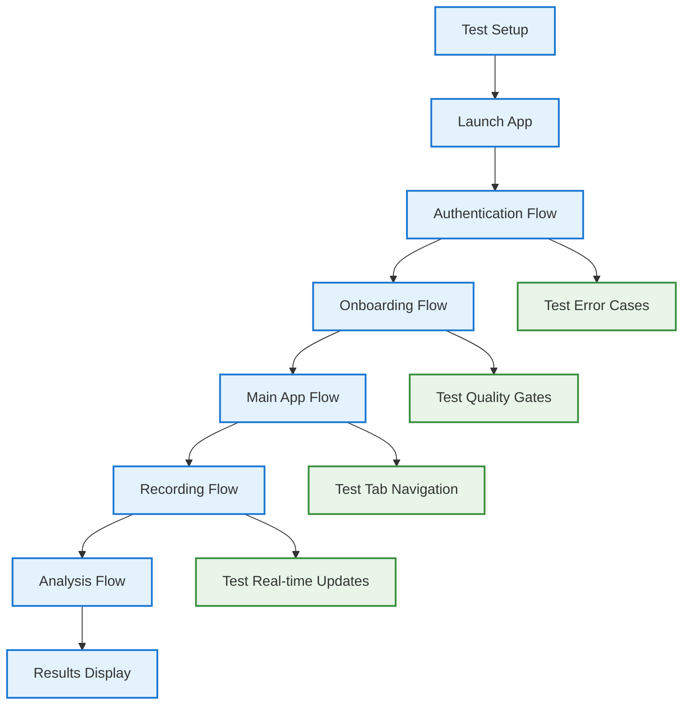

## Legend & Conventions

### View Types
| Symbol | View Type | Description |
|--------|-----------|-------------|
| 📱 | iOS Native | SwiftUI views and components |
| 🔐 | Authentication | Login, signup, and auth flows |
| 🎤 | Voice Recording | Audio capture and analysis |
| 📊 | Data Display | Results, charts, and metrics |
| ⚙️ | Settings | Configuration and preferences |

### Flow Types
| Symbol | Flow Type | Description |
|--------|-----------|-------------|
| ➡️ | Navigation | Screen transitions and routing |
| 🔄 | State Change | Data updates and UI refreshes |
| ⚡ | Real-time | Live updates and listeners |
| ❌ | Error Handling | Error states and recovery |

### Color Coding
- **Blue (#1976d2)**: Authentication and navigation flows
- **Green (#388e3c)**: Voice analysis and recording flows
- **Orange (#f57c00)**: Data display and results flows
- **Red (#d32f2f)**: Error states and edge cases
- **Purple (#7b1fa2)**: Settings and configuration flows

## Maintenance Guidelines

### When to Update This Document
1. **New user flows**: Adding new screens or navigation paths
2. **View changes**: Modifying existing view hierarchies
3. **State management**: Changes to authentication or data flow
4. **Error handling**: New error states or recovery flows
5. **Performance**: Loading states or user feedback changes

### How to Update
1. **Update diagrams**: Ensure Mermaid syntax is valid
2. **Test flows**: Verify navigation paths are accurate
3. **Document changes**: Add notes for significant updates
4. **Review with team**: Ensure all flows are represented
5. **Validate completeness**: Check that all views are included

### Mermaid Tips
- Use `graph TD` for top-down flow diagrams
- Use `sequenceDiagram` for interaction patterns
- Use `stateDiagram-v2` for state management
- Keep diagrams focused and readable
- Use consistent naming and color coding

---

**Maintainers**: This user journey document reflects the actual implementation and should be updated whenever user flows change. All diagrams are based on the current codebase and represent real user experiences. 